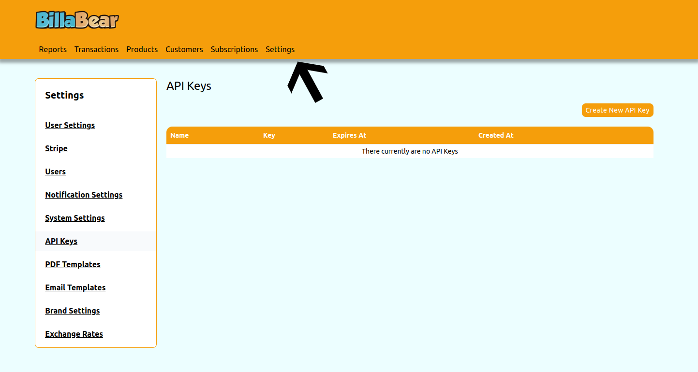
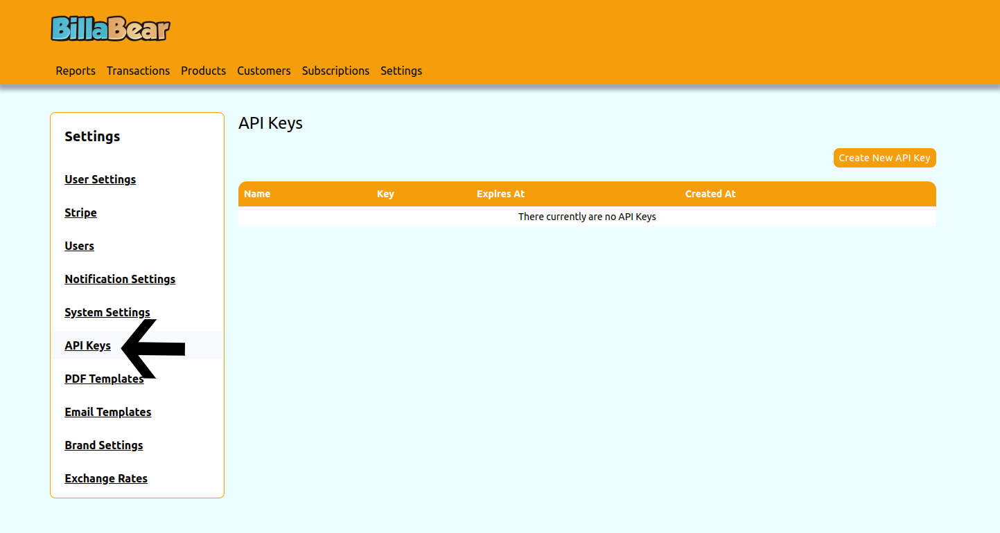
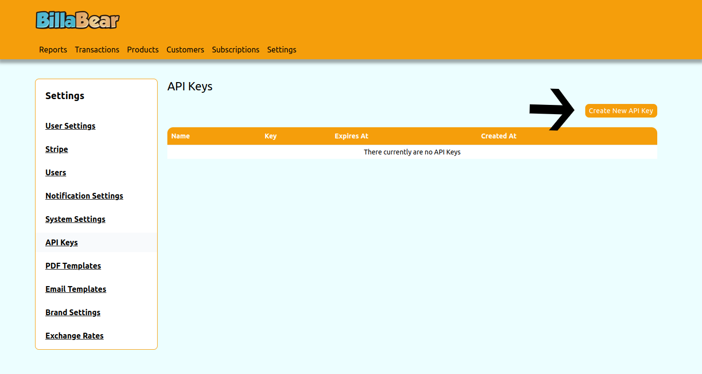
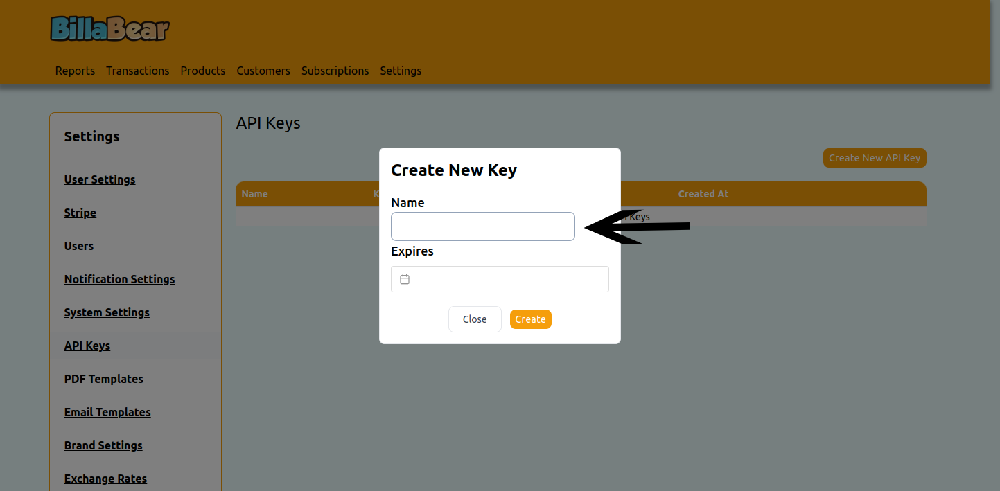
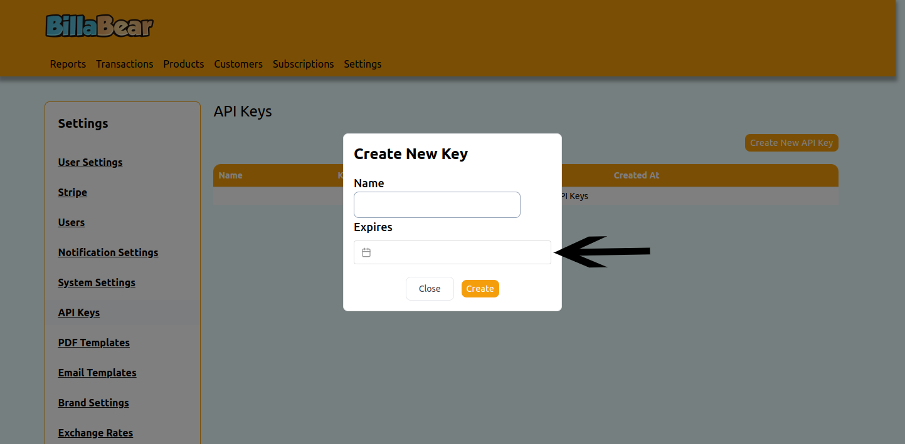
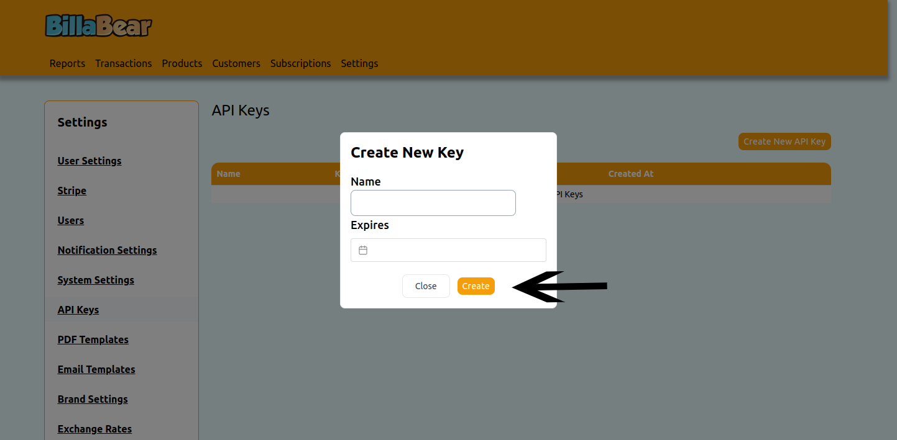

When integrating with the API you need to provide an API key for all requests to authenicate that the client is allowed to make the request.

## Permissions

To be able to toogle a customer's status the BillaBear admin system you will need to have a ROLE of developer or higher.

[Check the user roles here.](../../user/user_roles/)

## How To

### Step 1. Click Settings

### Step 2. Click API Keys

### Step 3. Click Create

### Step 4. Enter Name

### Step 5. Enter Expires At

### Step 6. Click Create

