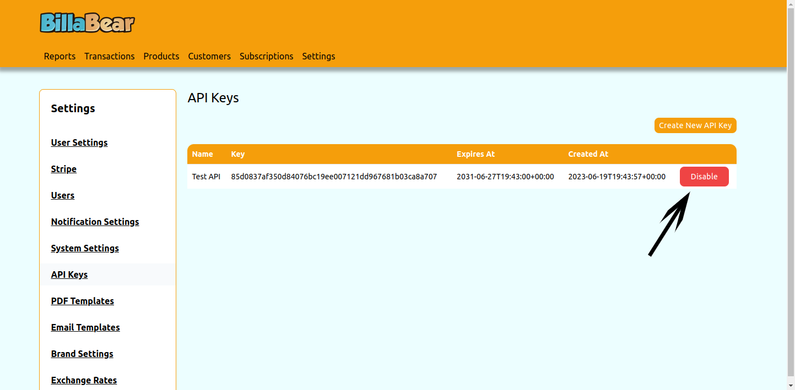

When integrating with the API you need to provide an API key for all requests to authenicate that the client is allowed to make the request. It's often required to disable a key.

## Permissions

To be able to toogle a customer's status the BillaBear admin system you will need to have a ROLE of developer or higher.

[Check the user roles here.](../user_roles/)

## How To

### Step 1. Click Disable

