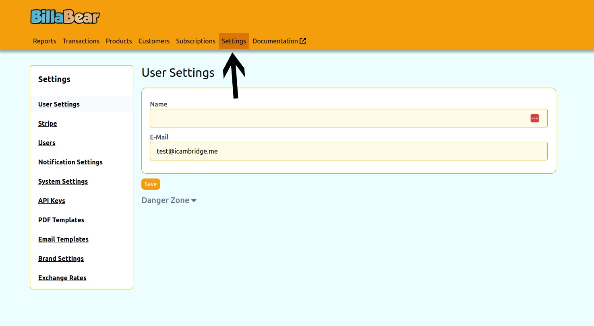
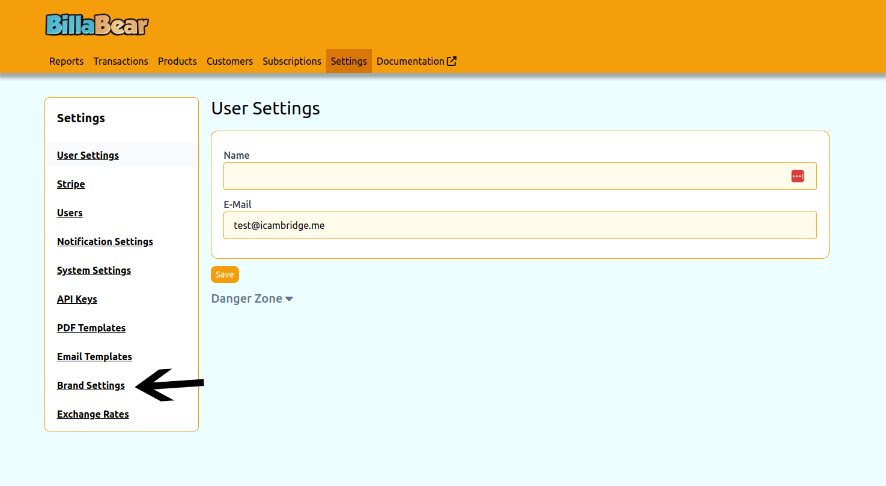
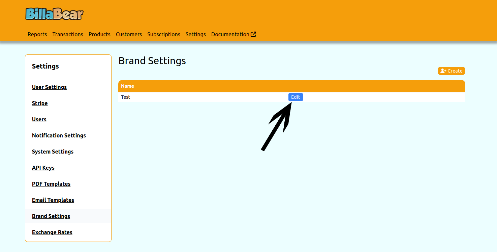
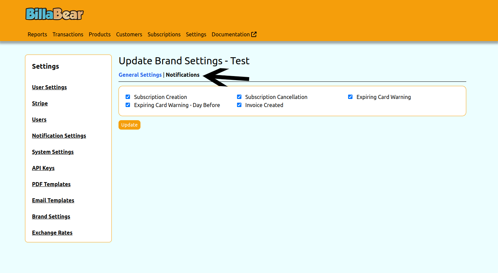
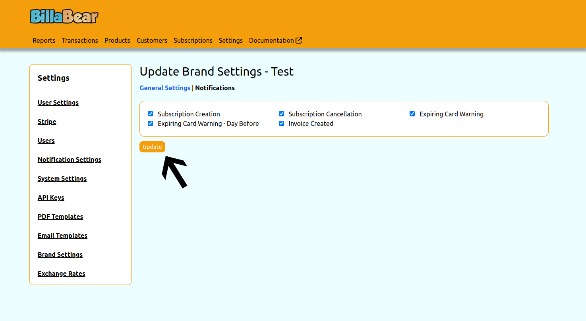

# Notification Settings

## Overview

Notification settings allow you to control which automated emails and notifications are sent to your customers. This feature gives you precise control over your customer communications, ensuring they receive only the notifications that are relevant and important to them.

## Permissions Required

To configure notification settings in the BillaBear admin system, you need to have a role of Account Manager or higher.

[Learn more about user roles here](../user_roles/)

## Available Notification Types

BillaBear offers the following notification types that can be individually enabled or disabled:

### Subscription Notifications

- **Subscription Creation**: Sent when a new subscription is created for a customer. This notification confirms the subscription details and start date.

- **Subscription Cancellation**: Sent when a subscription is cancelled. This notification confirms the cancellation and provides information about the end date.

- **Trial Ending Warning**: Sent before a trial period ends to remind customers that they will soon be charged for their subscription.

- **Before Charge Warnings**: Sent before a recurring charge is processed. Options include:
  - None: No warning is sent
  - 1 Day: Warning sent 1 day before the charge
  - 3 Days: Warning sent 3 days before the charge
  - 7 Days: Warning sent 7 days before the charge

### Invoice and Payment Notifications

- **Invoice Created**: Sent when a new invoice is generated for a customer.

- **Invoice Overdue**: Sent when an invoice payment is past due.

- **Payment Failure**: Sent when a payment attempt fails.

- **Quote Created**: Sent when a new quote is created for a customer.

### Card Notifications

- **Expiring Card Warning**: Sent when a customer's payment card is approaching its expiration date.

- **Expiring Card Day Before**: Sent one day before a customer's payment card expires.

## How Notification Settings Work

Each notification type can be individually enabled or disabled for each brand in your BillaBear account. When a notification is enabled (checkbox is ticked), the corresponding emails will be sent to customers when the relevant event occurs.

When a notification is disabled (checkbox is unticked), no email will be sent for that event, even if the event occurs.

## Effects of Notification Settings

- **Enabled notifications**: Customers receive timely information about their subscriptions, invoices, and payment methods.
- **Disabled notifications**: Customers will not receive automated emails for the disabled notification types.

Carefully consider which notifications to enable or disable based on your business needs and customer preferences. For example:

- Essential notifications like payment failures should typically remain enabled
- Marketing-related notifications might be disabled for certain brands
- You might want different notification settings for different customer segments

## How to Configure Notification Settings

Follow these steps to configure notification settings for a brand:

### Step 1: Access Settings

Click on the "Settings" option in the main navigation menu.

### Step 2: Select Brand Settings

Click on "Brand Settings" in the settings menu.

### Step 3: Edit a Brand

Find the brand you want to configure and click the "Edit" button.

### Step 4: Navigate to Notifications Tab

Click on the "Notifications" tab to access notification settings.

### Step 5: Configure and Save

Enable or disable notifications by checking or unchecking the boxes next to each notification type. When finished, click the "Update" button to save your changes.

## Best Practices

- **Review regularly**: Periodically review your notification settings to ensure they align with your current business needs.
- **Consider customer feedback**: Adjust notification settings based on customer feedback about communication frequency.
- **Test notifications**: After changing settings, test the affected notifications to ensure they work as expected.
- **Document your choices**: Keep a record of which notifications are enabled or disabled for each brand and why.