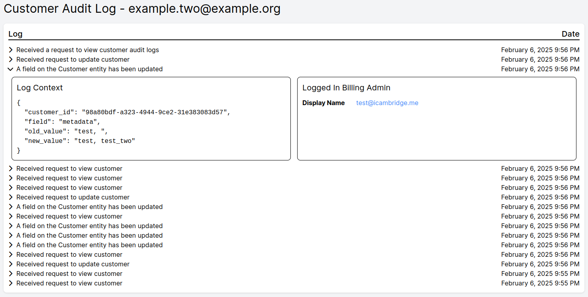

Audit Logging is an a useful functionality that allows you to see who has done what and when. It can also be a very useful functionality for when issues need to be escalated during customer support queries.

With audit logs you're able to see what has been viewed as well as saved changed to important data. For log entries relating to save changes you're able to see the old value as well as the new value. 

There are four audit log trails you can view:

* Overall - This shows everything
* Customer - This shows everything for a customer
* Subscription - This shows everything for a subscription
* Billing Admin - This shows everything a billing admin has done.

When viewing the logs you can expand the log to see the context relating to the log. You'll also be able to see which Billing Admin was responsible for the log entry.

## Overall

To view the overall audit log you need to click `Settings` and then go to `Audit Log`.

## Customer

To view the customer audit log you need to go to the view customer page and then click the `Audit Log` button.

## Subscription

To view the subscription audit log you need to go to the view subscription page and then click the `Audit Log` button.

## Billing Admin

To view the billing admin audit log you need to:

* Click `Settings`
* Click `Users`
* Click `Audit Log` for the user you want to see the audit log