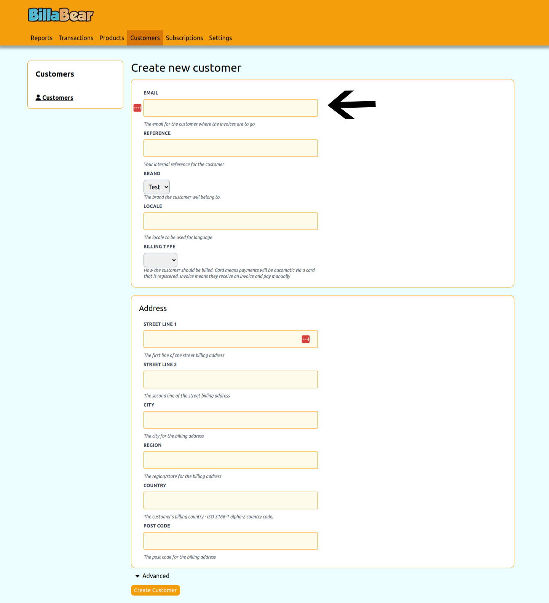
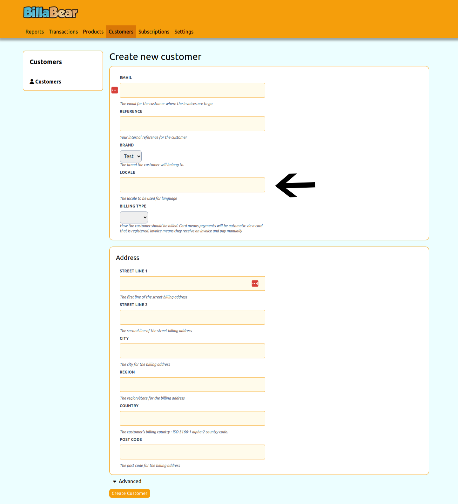
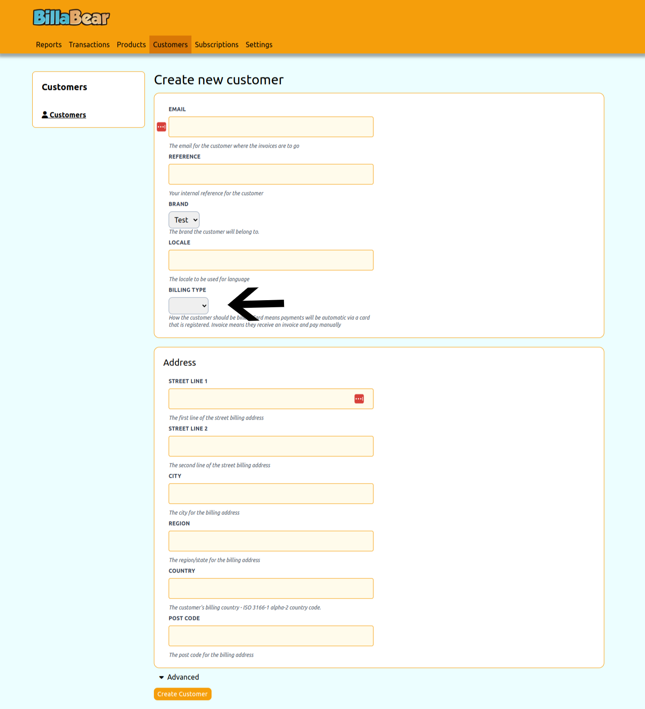
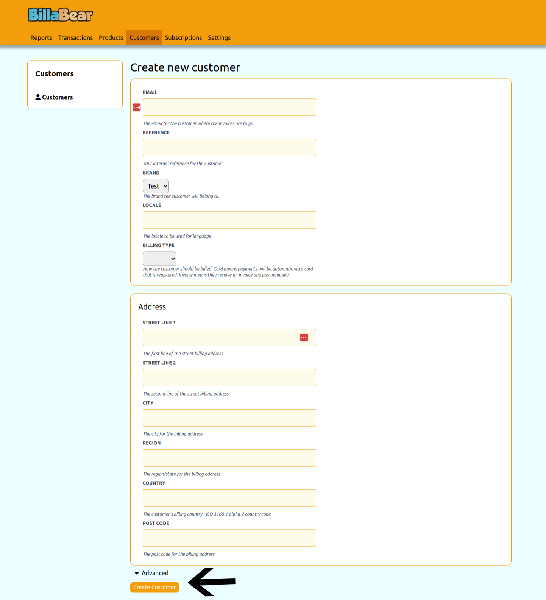

# Creating Customers

Creating a customer is a common task when onboarding new clients or users to your system. BillaBear provides a straightforward process to add new customers with all the necessary information.

## Required Permissions

To create a customer in the BillaBear admin system, you need to have a role of **Account Manager** or higher.

[Learn more about user roles here](../user_roles/)

## Understanding Customer Fields

When creating a customer, you'll need to provide several pieces of information:

- **Email**: The customer's primary email address where invoices and communications will be sent
- **Locale**: The customer's preferred language and regional settings (e.g., en_GB, de_DE)
- **Billing Type**: How the customer will be billed:
  - **Card**: Automatic payments via a registered payment card
  - **Invoice**: Manual payments after receiving an invoice
- **Reference**: (Optional) Your internal reference for this customer
- **Company Name**: (Optional) For business customers
- **Address Information**: (Optional) Billing address details

## Step-by-Step Guide

### Step 1: Access the Create Customer Form

From the Customers page, click the **Create** button in the top-right corner.

### Step 2: Enter Customer Email

Enter the customer's email address. This is a required field and must be a valid email format.

### Step 3: Select Customer Locale

Choose the appropriate locale for the customer. This determines the language and formatting for communications.

### Step 4: Choose Billing Type

Select how the customer will be billed:
- **Card**: For automatic payments
- **Invoice**: For manual payments

### Step 5: Submit the Form

After entering all required information, click the **Create** button to add the customer to your system.

## What Happens Next

After creating a customer:

1. The customer is added to your BillaBear database
2. You'll be redirected to the customer's profile page
3. You can then:
   - Add payment methods
   - Create subscriptions
   - Update customer information
   - Set up invoice delivery preferences

## Troubleshooting

If you encounter errors when creating a customer:

- Ensure the email address is in a valid format
- Check that all required fields are completed
- Verify you have the necessary permissions