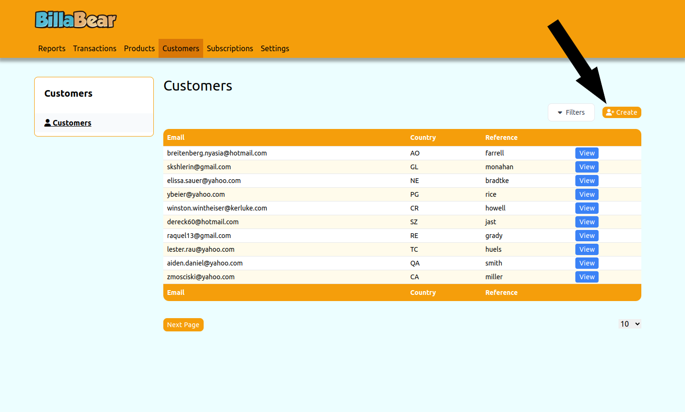

Creating a customer is a common task for account managers when onboarding new clients. BillaBear makes this an easy task.

## Permissions

To be able to create subscription for a customer via the BillaBear admin system you will need to have a ROLE of Account Manager or higher.

[Check the user roles here.](../user_roles/)

## How To

### Step 1. Click Create

### Step 2. Input Email

### Step 3. Input Locale

### Step 4. Pick Billing Type

### Step 5. Click Create

