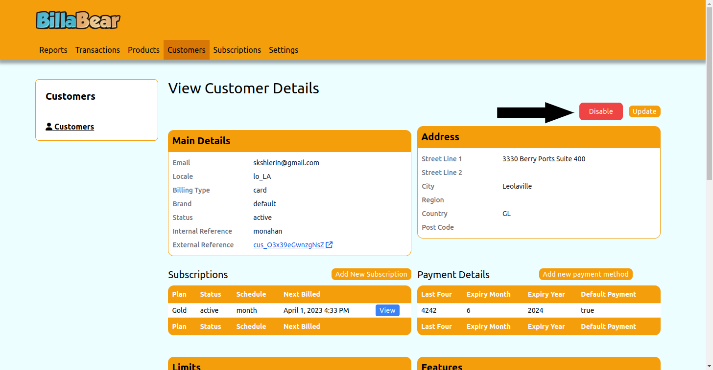
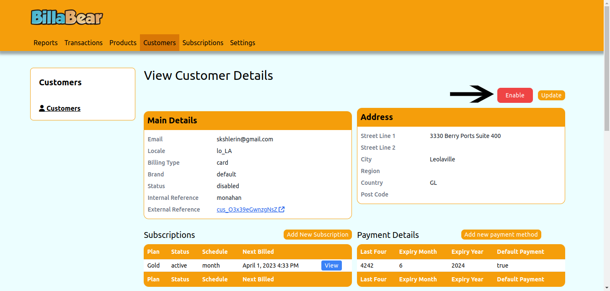

# Enabling and Disabling Customers

Sometimes you may need to temporarily disable a customer's account or re-enable a previously disabled account. This feature allows you to control customer access without deleting their data.

## When to Use This Feature

You might need to disable a customer account for various reasons:
- Non-payment of invoices
- During contract negotiations or disputes
- At the customer's request (temporary pause)
- For compliance or security reasons

## Required Permissions

To change a customer's status in the BillaBear admin system, you need to have a role of **Customer Support** or higher.

[Learn more about user roles here](../user_roles/)

## Understanding the Effects

When you disable a customer:

1. **API Access**: The customer's access to API endpoints is restricted
2. **Limits API**: The limits API endpoint will indicate the customer is disabled
3. **Subscriptions**: Existing subscriptions remain in the system but may be restricted
4. **Billing**: Depending on your configuration, billing may be paused

Enabling a customer restores their full access to your services.

## Step-by-Step Guide

### Disabling a Customer

1. Navigate to the customer's profile page
2. Locate the "Disable" button in the customer actions area
3. Click the "Disable" button

4. The system will immediately disable the customer
5. The button will change to "Enable" to indicate the customer's new status

### Enabling a Customer

1. Navigate to the disabled customer's profile page
2. Locate the "Enable" button in the customer actions area
3. Click the "Enable" button

4. The system will immediately re-enable the customer
5. The button will change to "Disable" to indicate the customer's new status

## Best Practices

- **Communication**: Always inform customers before disabling their account
- **Documentation**: Record the reason for disabling a customer in your internal notes
- **Regular Review**: Periodically review disabled customers to determine if they should be re-enabled or removed
- **Audit Trail**: BillaBear maintains an audit log of all enable/disable actions for compliance purposes