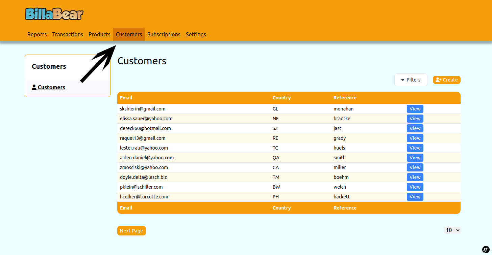
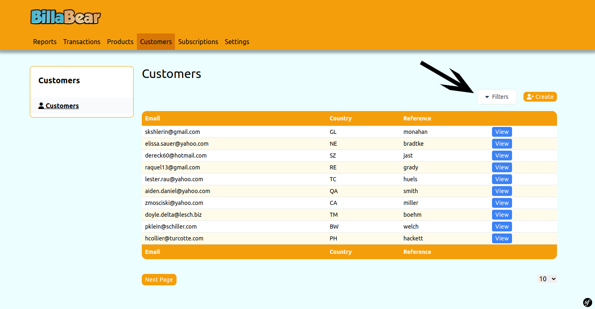
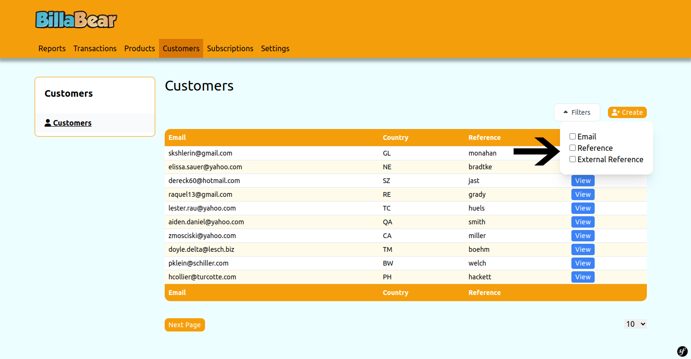
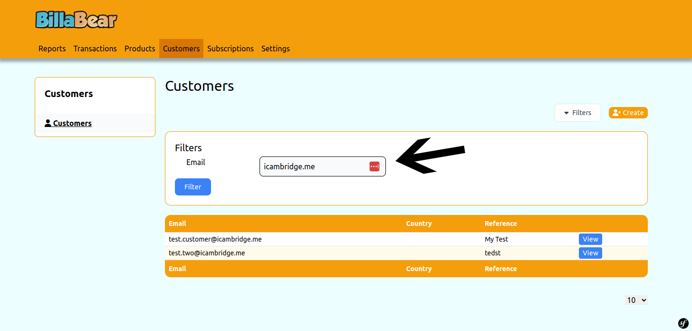
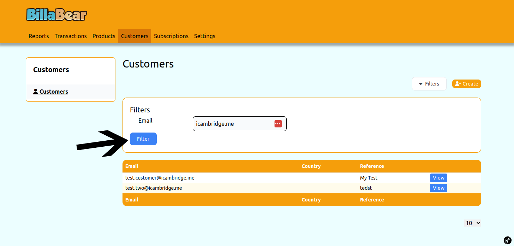

In order to manage a customer's subscription and billing you need to be able to find the customers. 

## Filters
There are the following filters:

* Email
* Reference
* External Reference

### Email

The email filter is a search for any email containing the value. If you search for "iain" it would match for:

* iain@billabear.com
* me@iain.sexy
* me@iaincambridge.me

### Reference

Reference this is a search for any reference containing the value.

### External Reference

External reference is the customer id from stripe. So if you have that you're able to search.

## How To 

### Step 1. Go to Customers Search

### Step 2. Click Filters

### Step 3. Select Filters

### Step 4. Enter Filter

### Step 5. Press Filter

