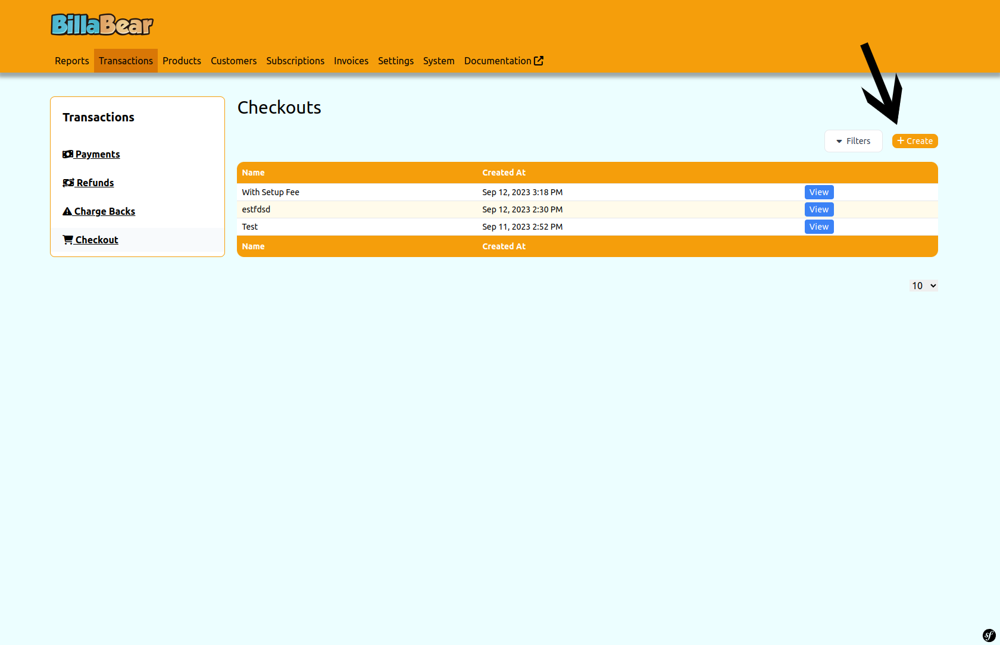
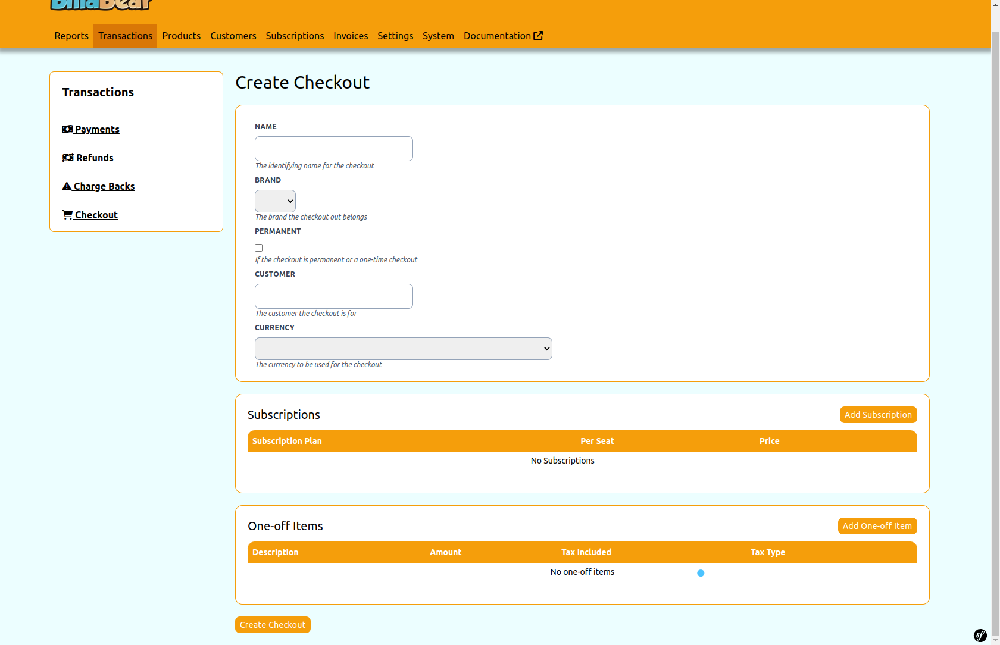

# Creating a Hosted Checkout

Creating a hosted checkout allows you to generate a payment page with a unique URL that you can share with your customers. This page enables them to make payments or subscribe to your services without needing to create an account first.

## Required Permissions

To create a hosted checkout in the BillaBear admin system, you need to have a role of **Account Manager** or higher.

[Learn more about user roles here](../user_roles/)

## Understanding Hosted Checkout Fields

When creating a hosted checkout, you'll need to provide several pieces of information:

### Required Fields

- **Name**: A descriptive name for the checkout (for your internal reference)
- **Brand**: The brand settings to use for the checkout (affects appearance and email templates)
- **Slug**: A URL-friendly identifier that will be used in the checkout URL

### Optional Fields

- **Permanent**: Whether the checkout should never expire (if not permanent, you can set an expiration date)
- **Customer**: An existing customer to associate with the checkout (leave empty for public checkouts)
- **Expiration Date**: When the checkout should expire (only if not permanent)
- **Success Redirect**: URL to redirect customers to after successful payment
- **Cancel Redirect**: URL to redirect customers to if they cancel the payment

## Step-by-Step Guide

### Step 1: Access the Create Checkout Form

From the Hosted Checkouts page, click the **Create** button in the top-right corner.

### Step 2: Fill in the Checkout Details

Complete the form with the necessary information:

1. Enter a descriptive **Name** for the checkout
2. Select the appropriate **Brand** from the dropdown
3. Enter a unique **Slug** for the checkout URL
4. Choose whether the checkout should be **Permanent** or have an expiration date
5. Optionally, select an existing **Customer** if the checkout is for a specific customer
6. If not permanent, set an **Expiration Date**
7. Optionally, enter **Success Redirect** and **Cancel Redirect** URLs

### Step 3: Add Items (Optional)

If you want to include one-time items in the checkout:

1. Click the **Add Item** button
2. Enter a **Description** for the item
3. Enter the **Amount** to charge
4. Select the **Currency**
5. Choose whether the amount **Includes Tax**
6. Select the appropriate **Tax Type**
7. Click **Add** to include the item in the checkout

### Step 4: Add Subscriptions (Optional)

If you want to include subscriptions in the checkout:

1. Click the **Add Subscription** button
2. Select the subscription **Plan** from the dropdown
3. Select the **Price** option for the plan
4. Optionally, specify the number of **Seats** if applicable
5. Click **Add** to include the subscription in the checkout

### Step 5: Create the Checkout

After entering all the required information and adding any items or subscriptions, click the **Create** button at the bottom of the form to create the hosted checkout.

## What Happens Next

After creating a hosted checkout:

1. The checkout is added to your BillaBear system
2. A unique URL is generated based on the slug you provided
3. You can share this URL with your customers via email, your website, or other channels
4. When customers visit the URL, they can complete their purchase
5. After payment, customers are redirected to the success URL you specified (or a default thank you page)

## Managing Hosted Checkouts

You can view and manage all your hosted checkouts from the Hosted Checkouts page. From there, you can:

- View checkout details
- Copy the checkout URL
- Invalidate a checkout (prevent it from being used)
- Create new checkouts

## Troubleshooting

If you encounter issues when creating a hosted checkout:

- Ensure all required fields are completed
- Check that the slug is unique and contains only letters, numbers, underscores, and hyphens
- Verify that any items or subscriptions have valid tax types and prices
- Confirm that success and cancel redirect URLs are valid and include the http:// or https:// prefix
- Verify you have the necessary permissions (Account Manager or higher)