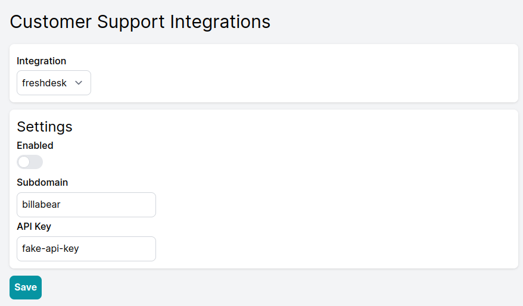

# Customer Support Integrations

BillaBear integrates with popular customer support platforms to help your support team provide better service. These integrations allow your customer support agents to quickly access a customer's BillaBear profile directly from your support system.

## Benefits of Customer Support Integration

* **Faster Customer Service**: Support agents can quickly access billing information without switching systems
* **Reduced Errors**: Direct access to customer profiles eliminates manual searching
* **Better Customer Experience**: Resolve billing inquiries more efficiently
* **Contextual Information**: View subscription and payment history alongside support tickets

## Setting Up Customer Support Integrations

### Accessing Customer Support Integrations

1. Log in to your BillaBear admin account
2. Navigate to the main menu
3. Select "Integrations"
4. Choose "Customer Support"

## Available Integrations

### Zendesk

Zendesk is a popular customer service platform that provides support ticket system, knowledge base, and live chat capabilities.

#### Setting Up Zendesk Integration

1. From the Customer Support Integrations page, select "Zendesk" from the dropdown menu
2. You will need to provide three pieces of information:
   * **Subdomain**: Your Zendesk subdomain (e.g., if your Zendesk URL is `company.zendesk.com`, enter `company`)
   * **Username**: Your Zendesk admin username (usually an email address)
   * **API Token**: Your Zendesk API token

#### Getting Your Zendesk API Credentials

1. Log in to your Zendesk admin account
2. Click on the Admin icon (gear icon) in the sidebar
3. Select "API" under "Channels"
4. Enable Token Access if it isn't already enabled
5. Click "Add API Token"
6. Give your token a description (e.g., "BillaBear Integration")
7. Copy the API token that is generated
8. Return to BillaBear and enter your subdomain, username, and the API token
9. Click "Save" to establish the connection

For more detailed instructions, refer to [Zendesk's API documentation](https://support.zendesk.com/hc/en-us/articles/4408889192858-Managing-access-to-the-Zendesk-API#topic_tcb_fk1_2yb).

### Freshdesk

Freshdesk is a cloud-based customer support software that provides helpdesk support with automation tools.

#### Setting Up Freshdesk Integration

1. From the Customer Support Integrations page, select "Freshdesk" from the dropdown menu
2. You will need to provide two pieces of information:
   * **Subdomain**: Your Freshdesk subdomain (e.g., if your Freshdesk URL is `company.freshdesk.com`, enter `company`)
   * **API Key**: Your Freshdesk API key

#### Getting Your Freshdesk API Key

1. Log in to your Freshdesk account
2. Click on your profile picture in the top-right corner
3. Select "Profile settings"
4. Your API key will be displayed on the right side of your profile page
5. Copy the API key
6. Return to BillaBear and enter your subdomain and API key
7. Click "Save" to establish the connection

For more detailed instructions, refer to [Freshdesk's API documentation](https://support.freshdesk.com/support/solutions/articles/215517-how-to-find-your-api-key).

## Using the Integration

Once the integration is set up, your support agents will be able to:

1. View a customer's BillaBear profile directly from your support platform
2. Access subscription details, payment history, and billing information
3. Provide more informed responses to billing and subscription inquiries

## Troubleshooting

If you encounter issues with your customer support integration:

* Verify that your API credentials are correct
* Ensure your API token has not expired
* Check that your customer support platform is accessible
* Verify that you have admin permissions in your support platform

For persistent issues, contact BillaBear support with details of the problem you're experiencing.