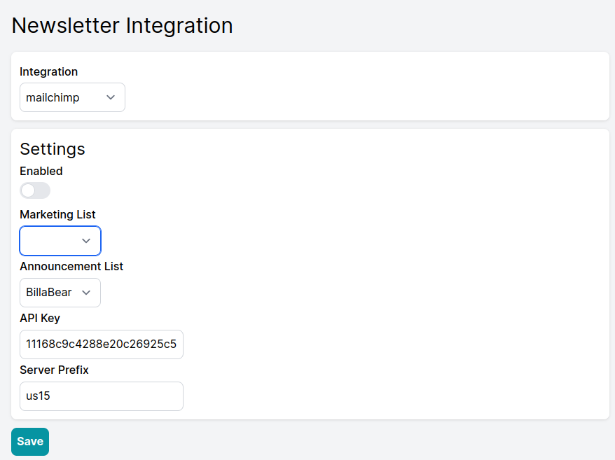
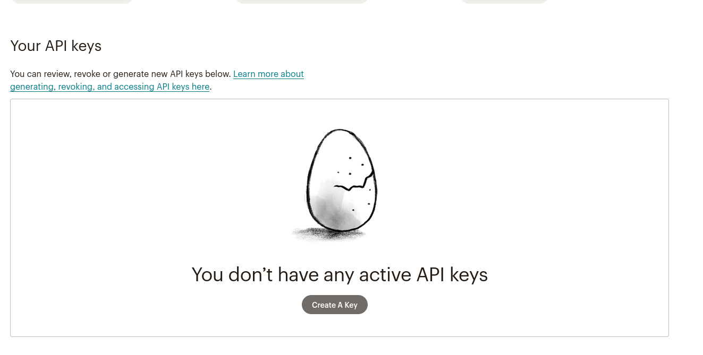

# Newsletter Integrations

BillaBear integrates with popular email marketing platforms such as MailChimp and EmailOctopus. These integrations allow you to automatically add customers to your newsletter lists based on their preferences and subscription status.

## Newsletter List Types

BillaBear supports two different types of newsletter lists, each serving a distinct purpose:

### Marketing List

The Marketing List is designed for promotional and marketing communications. For customers to be added to this list:

* They must explicitly opt into marketing communications
* The marketing opt-in is a property on the customer profile that can be:
  * Set during customer creation
  * Toggled on/off in the customer's profile
  * Updated by the customer through your customer portal

**Note**: Adding customers to marketing lists without explicit consent may violate privacy regulations such as GDPR or CAN-SPAM.

### Announcement List

The Announcement List is designed for sending important service announcements and updates to all customers. These communications:

* Are not considered marketing emails
* Can be sent to all customers regardless of marketing preferences
* Should only be used for service-related announcements, policy updates, or critical information

## Setting Up Newsletter Integrations

### Accessing Newsletter Integrations

1. Log in to your BillaBear admin account
2. Navigate to the main menu
3. Select "Integrations"
4. Choose "Newsletter"

## Available Integrations

### MailChimp

MailChimp is a popular email marketing platform that offers automation, segmentation, and analytics.

#### Setting Up MailChimp Integration

1. From the Newsletter Integrations page, select "MailChimp" from the dropdown menu
2. You will need to provide two pieces of information:
   * **API Key**: Your MailChimp API key
   * **Server Prefix**: The server prefix for your MailChimp account (e.g., "us1", "us2")

#### Getting Your MailChimp API Key

1. Log in to your MailChimp account
2. Click your profile image in the top-right corner
3. Select "Profile" from the dropdown menu
4. Click "Extras" in the menu
5. Select "API keys"
6. Click "Create A Key" or use an existing key
7. Copy the API key that is generated
8. Note your server prefix (found in your MailChimp URL, e.g., "us1" in "https://us1.admin.mailchimp.com")
9. Return to BillaBear and enter your API key and server prefix
10. Click "Save" to establish the connection

### EmailOctopus

EmailOctopus is an email marketing platform known for its simplicity and affordability.

#### Setting Up EmailOctopus Integration

1. From the Newsletter Integrations page, select "EmailOctopus" from the dropdown menu
2. You will need to provide your EmailOctopus API key

#### Getting Your EmailOctopus API Key

1. Log in to your EmailOctopus account
2. Click your profile image in the top-right corner
3. Select "Integrations & API" from the dropdown menu
4. Click the "API" tab
5. Click "Add a Key"
6. Enter a name for the API key (e.g., "BillaBear Integration")
7. Copy the API key that is generated
8. Return to BillaBear and enter your API key
9. Click "Save" to establish the connection

## Configuring List Mappings

After connecting your newsletter platform, you need to configure which lists to use:

1. In the Newsletter Integration settings, locate the "List Mapping" section
2. Select which MailChimp or EmailOctopus list to use for:
   * Marketing communications
   * Announcement communications
3. Click "Save" to apply your settings

## Testing Your Integration

To verify your newsletter integration is working correctly:

1. Create a test customer with marketing opt-in enabled
2. Check your newsletter platform to confirm the customer was added to the appropriate list
3. Update the customer's marketing preferences in BillaBear
4. Verify that the changes are reflected in your newsletter platform

## Troubleshooting

If you encounter issues with your newsletter integration:

* Verify that your API credentials are correct
* Ensure your newsletter lists exist and are active
* Check that your newsletter platform is accessible
* Verify that you have sufficient permissions in your newsletter platform

For persistent issues, contact BillaBear support with details of the problem you're experiencing.