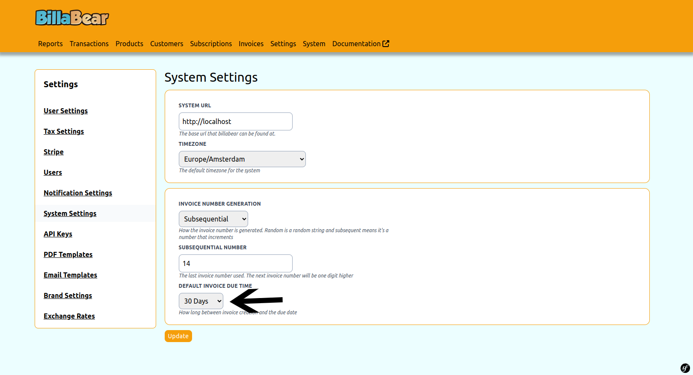
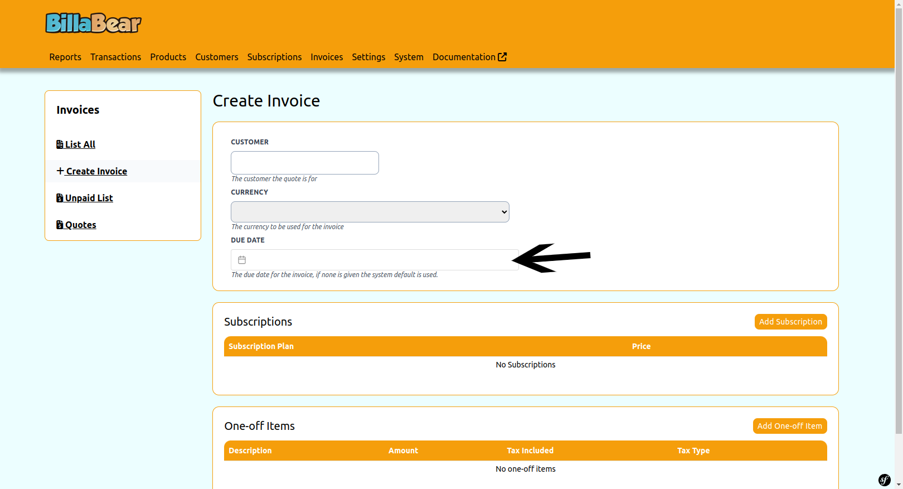

# Invoice Due Dates

When invoicing customers, it's important to clearly communicate when payment is expected. BillaBear allows you to set due dates for invoices, either using a system-wide default or specifying dates for individual invoices.

## Understanding Due Dates

The due date on an invoice indicates when the customer should make payment. BillaBear offers two ways to manage due dates:

1. **System Default** - Set a standard payment term (e.g., 30 days) that applies to all invoices
2. **Manual Setting** - Specify a custom due date when creating an individual invoice

## Setting the System Default Due Date

The system default determines how many days after invoice creation the payment is due. This default is used whenever a specific due date isn't provided during invoice creation.

### How to Set the System Default

1. Navigate to **Settings** in the main menu
2. Select **System Settings**
3. Find the **Invoice Due Date** section
4. Enter the number of days for your standard payment terms
5. Click **Save** or **Update**

## Setting a Due Date for Individual Invoices

When creating an invoice manually, you can specify a custom due date that overrides the system default.

### How to Set a Custom Due Date

1. Navigate to the **Create Invoice** page
2. Fill in the customer and line item details
3. In the **Due Date** field, either:
   - Enter a specific date using the date picker
   - Leave it blank to use the system default
4. Complete the invoice creation process

## Best Practices for Due Dates

* Set a system default that aligns with your standard business terms
* Use custom due dates for special arrangements with specific customers
* Consider industry standards and local business practices when setting due dates
* Ensure your due dates comply with any contractual agreements you have with customers
