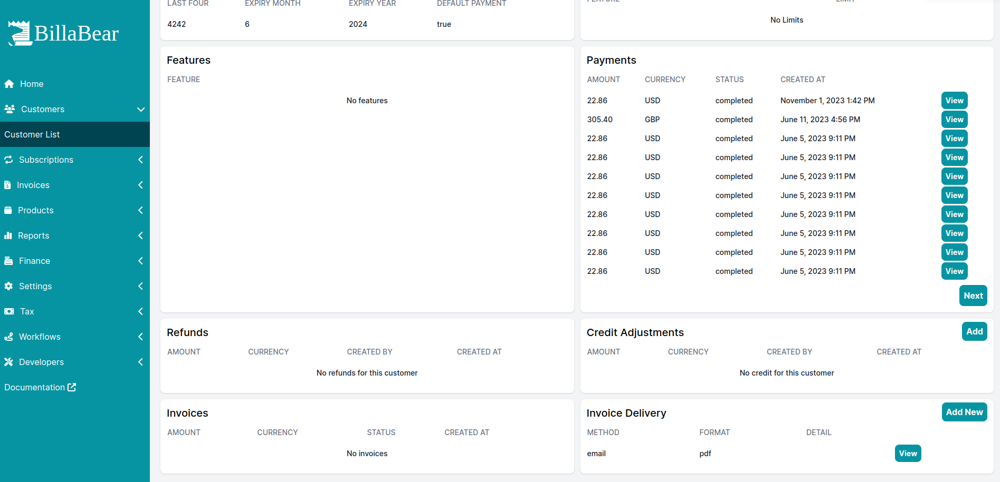
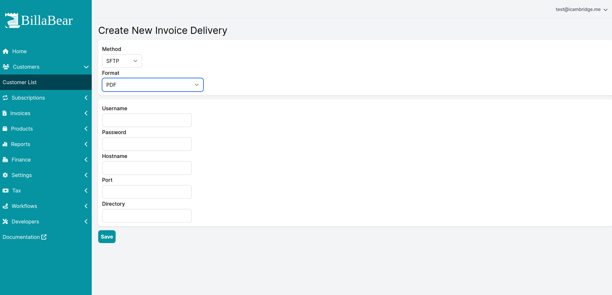
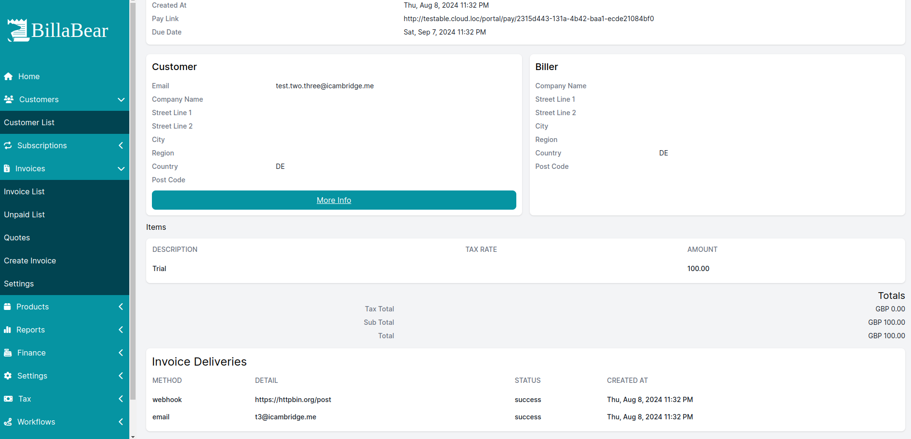

# Invoice Delivery

BillaBear provides a flexible invoice delivery system that allows you to send invoices to your customers through multiple channels and formats. This ensures that your customers receive invoices in the way that works best for them and your business.

## Available Delivery Methods

BillaBear supports the following delivery methods for invoices:

### Email Delivery

Send invoices directly to your customers' email addresses. This is the most common delivery method and works well for most businesses.

**Benefits:**
* Immediate delivery
* No additional setup required for customers
* Delivery confirmation tracking
* Customizable email templates

### SFTP Delivery

Securely transfer invoice files to your customers' servers using SFTP (Secure File Transfer Protocol). This method is ideal for customers who prefer automated processing of invoices.

**Benefits:**
* Secure, encrypted file transfer
* Automated delivery to customer systems
* Suitable for high-volume invoice processing
* Integration with customer's accounting systems

### Webhook Delivery

Send invoice data to a URL specified by your customer. This allows for real-time integration with your customers' systems.

**Benefits:**
* Real-time notification of new invoices
* Integration with custom systems
* Programmable responses and handling
* Reduced manual processing

## Supported Invoice Formats

BillaBear can deliver invoices in the following formats:

### PDF Format

Standard PDF documents that can be viewed, printed, and stored by your customers.

### ZUGfERD v1

A structured electronic invoice format that complies with European standards including XRechnung and Factur-X. This format embeds machine-readable XML data within a PDF, allowing for both human readability and automated processing.

## Setting Up Invoice Delivery

### Viewing Customer Delivery Settings

To view a customer's current invoice delivery settings:

1. Navigate to the customer's profile
2. Select the **Invoice Delivery** tab to see all configured delivery methods

### Creating a New Delivery Method

To set up a new invoice delivery method for a customer:

1. Navigate to the customer's profile
2. Select the **Invoice Delivery** tab
3. Click **Add Delivery Method**
4. Select the delivery method (Email, SFTP, or Webhook)
5. Configure the required settings:
   * For Email: Enter recipient email addresses
   * For SFTP: Enter server details, credentials, and file path
   * For Webhook: Enter the destination URL and authentication details
6. Select the invoice format (PDF or ZUGfERD)
7. Save the configuration

### Viewing Delivery Methods for an Invoice

To see which delivery methods were used for a specific invoice:

1. Navigate to the invoice details page
2. Look for the **Delivery** section, which shows all delivery methods used
3. Check the delivery status for each method

## Managing Invoice Delivery

### Testing Delivery Settings

Before relying on a delivery method for production invoices, you can test the configuration:

1. Set up the delivery method as described above
2. Click the **Test** button to send a test invoice
3. Verify that the test invoice was received correctly

### Troubleshooting Delivery Issues

If invoice delivery fails, BillaBear provides error information to help identify the problem:

* For Email: Check for incorrect email addresses or email server issues
* For SFTP: Verify server details, credentials, and network connectivity
* For Webhook: Ensure the destination URL is accessible and returns proper responses

### Best Practices

* Set up multiple delivery methods for critical customers to ensure they always receive invoices
* Use PDF format for general business use and ZUGfERD for customers who require structured data
* Regularly verify that delivery settings remain current, especially for SFTP and webhook configurations
* Consider your customers' preferences and technical capabilities when choosing delivery methods