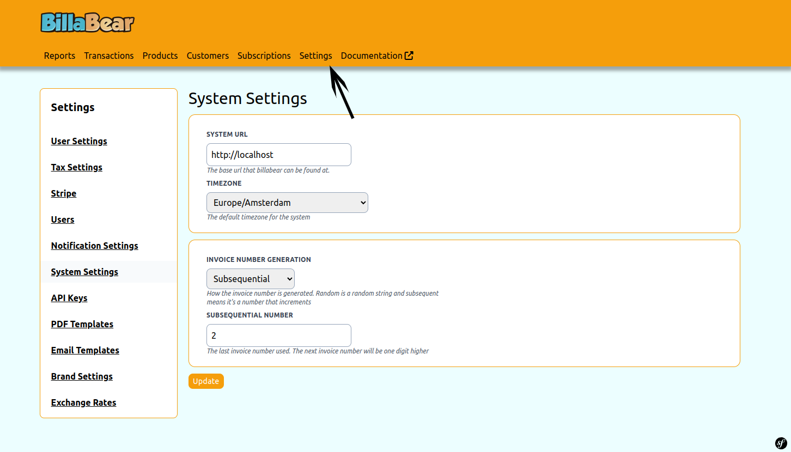
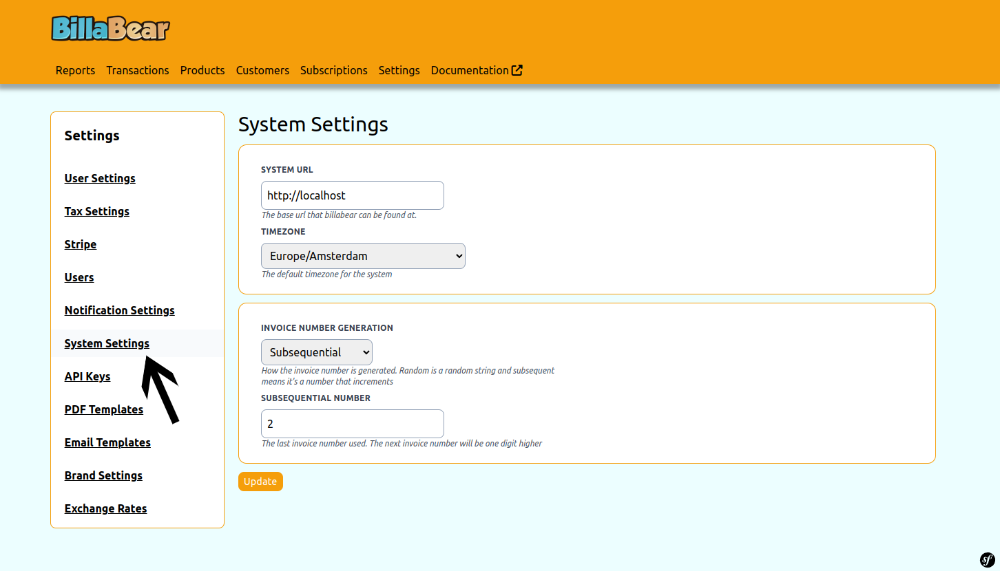
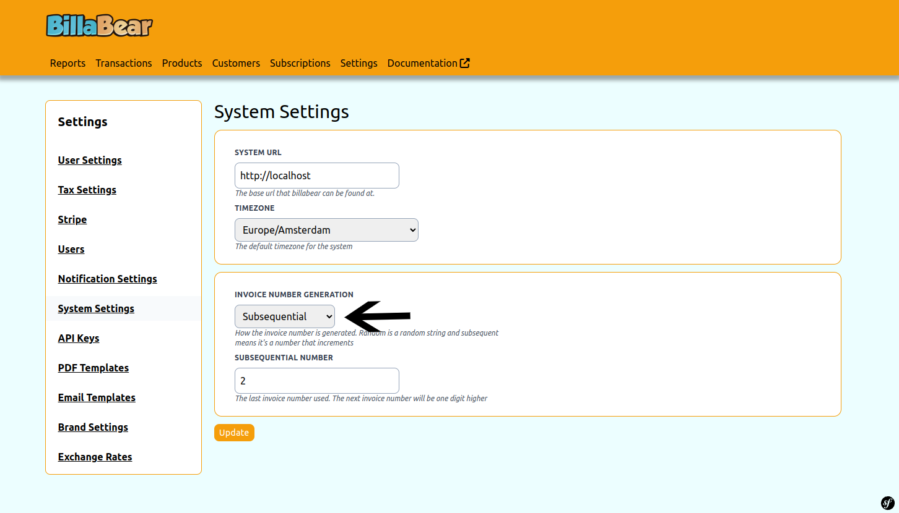
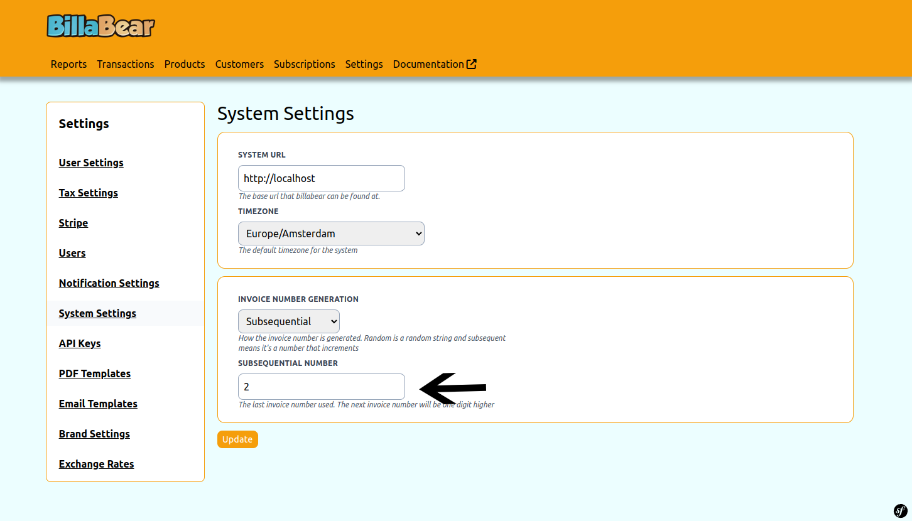
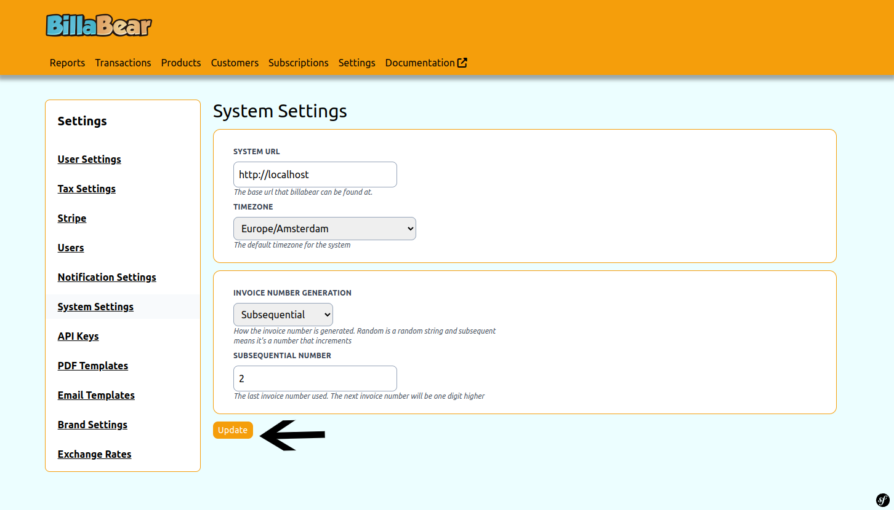

Some countries have specific laws to how the invoice numbers are to be created. Some companies have specific logic to create an invoice number.

## Permissions

To be able to toogle a customer's status the BillaBear admin system you will need to have a ROLE of Developer or higher.

[Check the user roles here.](../user_roles/)

## How It Works

There are currently:

### Random

Is a random number generated. This is used by default.

### Subsequential 

Each invoice the number is incremented from the last one. BillaBear allows you to define the number so you're able to start invoicing generation while keeping your invoice numbers correct.

## How To

### Step 1. Click Settings

### Step 2. Click System Settings

### Step 3. Choose Type

### Step 4. Set Number

:::note

Only displayed and used when subsequential.
:::

### Step 5. Click Update

