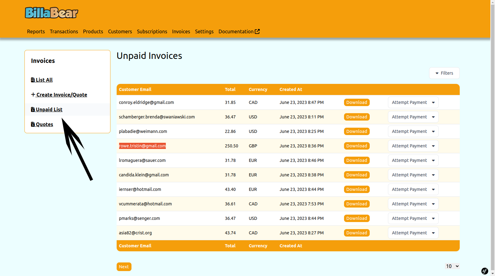
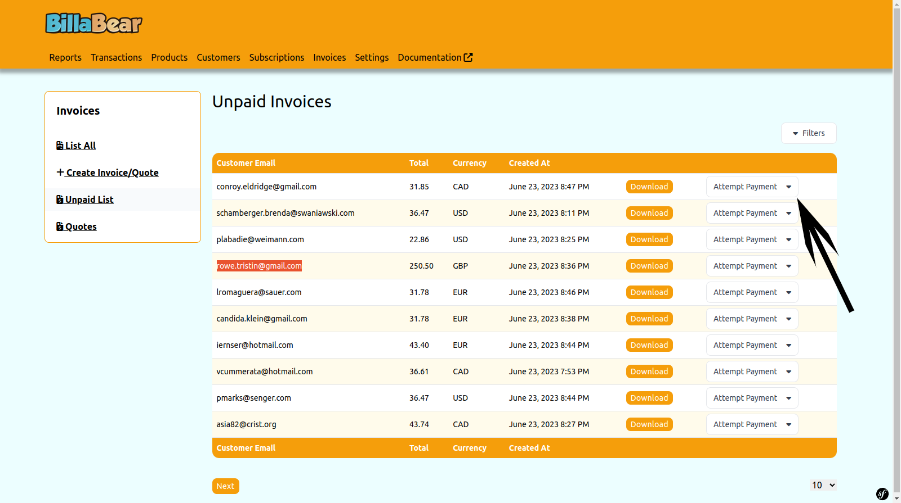
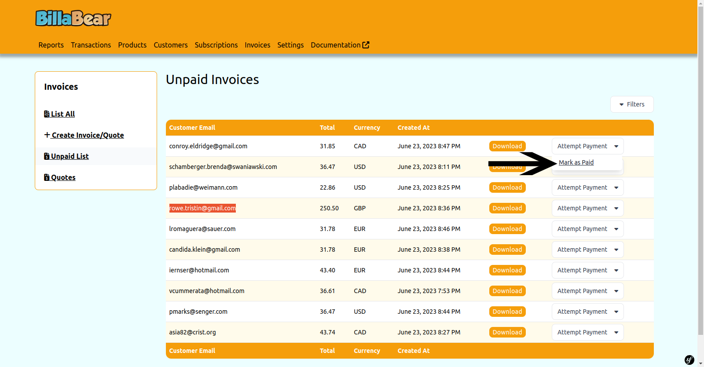

# Marking Invoices as Paid

When customers pay invoices outside of BillaBear's automated payment system (for example, via bank transfer or cheque), you need to manually mark these invoices as paid. This ensures your records are accurate and helps you track which invoices still require payment.

## Understanding Manual Payment Recording

BillaBear automatically records payments when customers pay through integrated payment methods (like credit cards or direct debits). However, for external payments, you need to manually update the invoice status to reflect that payment has been received.

When you mark an invoice as paid:
* The invoice status changes from "Unpaid" to "Paid"
* The invoice no longer appears in unpaid invoice reports
* The customer's payment history is updated
* Any automated payment reminders for this invoice will stop

## Required Permissions

To mark invoices as paid in BillaBear, you need administrator access with a role of **Developer** or higher.

[Learn more about user roles here](../user_roles/)

## How to Mark an Invoice as Paid

Follow these steps to record a manual payment for an invoice:

### Step 1: Access Unpaid Invoices

From the main menu, navigate to **Invoices** and select **Unpaid Invoices**. This displays a list of all invoices that haven't been paid yet.

### Step 2: Open the Actions Menu

Find the invoice you want to mark as paid in the list. Click the three-dot menu (⋮) in the row of that invoice to display available actions.

### Step 3: Select "Mark as Paid"

From the actions menu, click **Mark as Paid**. This will update the invoice status immediately.

## After Marking an Invoice as Paid

Once you've marked an invoice as paid:

* The invoice will disappear from the unpaid invoices list
* You can find the invoice in the "All Invoices" section with a "Paid" status
* The payment will be recorded with the current date as the payment date
* The customer's outstanding balance will be updated

## Best Practices for Manual Payments

* **Timely Recording**: Mark invoices as paid as soon as you confirm payment receipt
* **Payment Verification**: Always verify that funds have cleared before marking an invoice as paid
* **Record Keeping**: Consider adding a note about the payment method used (e.g., "Paid by bank transfer")
* **Regular Reconciliation**: Periodically reconcile your BillaBear records with your bank statements

## Reversing a Payment

If you accidentally mark an invoice as paid, contact your system administrator to reverse this action. The process typically requires accessing the invoice details and changing its status back to "Unpaid."