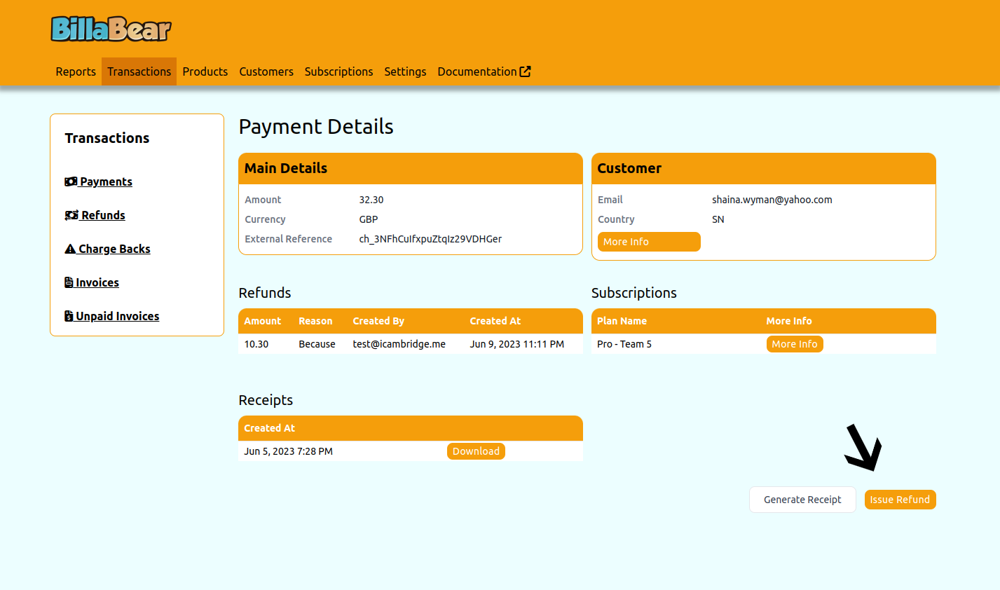
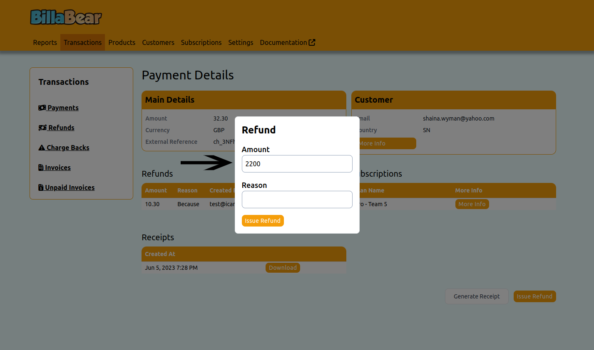
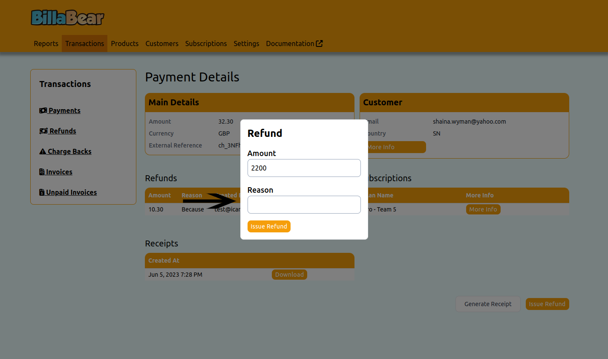

BillaBear allows you to manage refunds easily and keep track of who is issuing Refunds.

## Permissions

To be able to toogle a customer's status the BillaBear admin system you will need to have a ROLE of customer support or higher.

[Check the user roles here.](../user_roles/)

## How It Works

The customer support agent must provide the amount in the minor currency unit and the reason.

## How To

### Step 1. Click Issue

### Step 2. Enter Amount

### Step 3. Enter Reason

### Step 4. Click Issue

