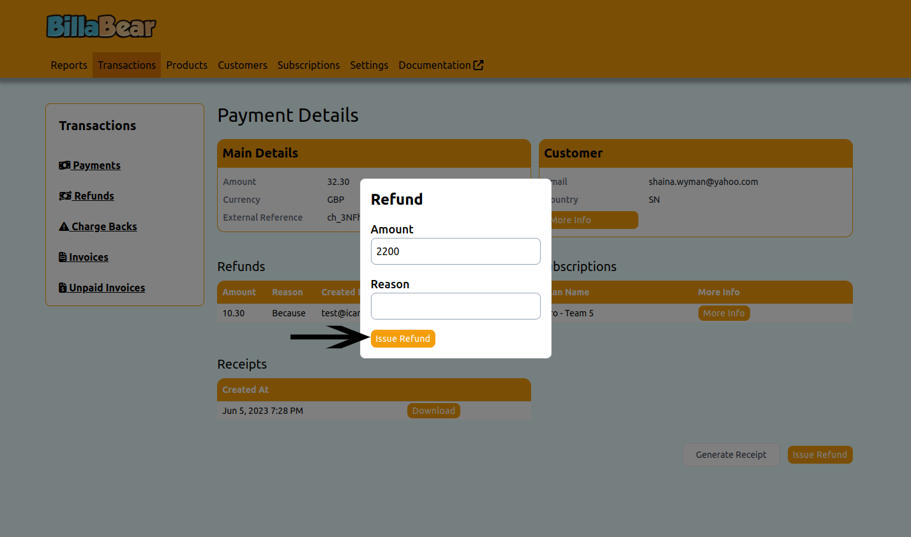

# Issuing Refunds

BillaBear allows you to process refunds easily and keeps a complete record of all refund transactions, including who issued them and why. This helps maintain accountability and provides a clear audit trail for financial reconciliation.

## Required Permissions

To issue refunds in BillaBear, you must have the **Customer Support** role or higher. This restriction ensures that only authorized personnel can process refunds.

[Learn more about user roles here](../user_roles/)

## Understanding Refunds in BillaBear

When processing a refund in BillaBear:

* You can refund up to the full amount of the original payment
* Each refund requires a documented reason for record-keeping
* BillaBear tracks who issued the refund and when
* The system prevents refunding more than the original payment amount
* Refunds are associated with the original payment for easy tracking

## How to Issue a Refund

### Step 1: Navigate to the Payment and Click "Issue Refund"

First, locate the payment you want to refund. This can be done from:
* The customer's payment history
* The main payments list
* An invoice or subscription page

Once you've found the payment, click the "Issue Refund" button.

### Step 2: Enter the Refund Amount

Enter the amount you wish to refund. BillaBear displays the maximum available amount that can be refunded (which is the original payment amount minus any previous refunds).

**Note:** The amount should be entered in the smallest unit of currency (e.g., pence, cents). For example, to refund £10.00, enter 1000.

### Step 3: Provide a Reason for the Refund

Enter a clear explanation for why the refund is being issued. This information is important for:
* Internal record-keeping
* Audit purposes
* Customer service tracking
* Financial reporting

Be specific and concise in your explanation.

### Step 4: Confirm and Process the Refund

Review the refund details and click "Issue Refund" to process the transaction. Once confirmed, the refund will be processed through the original payment method when possible.

## After Issuing a Refund

After a refund is processed:

* The refund appears in the payment's history
* The available refund amount for the payment is reduced
* The refund is recorded in financial reports
* The customer may receive a notification (depending on your notification settings)

## Troubleshooting Refunds

If you encounter issues when processing refunds:

* **Refund Amount Too High**: Ensure you're not attempting to refund more than the available amount
* **Permission Denied**: Verify you have the required Customer Support role
* **Payment Provider Error**: Check that the original payment method supports refunds
* **System Error**: Contact your system administrator if persistent errors occur