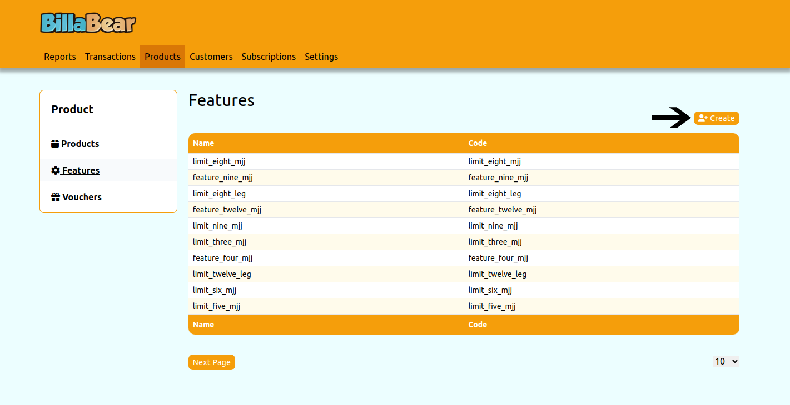
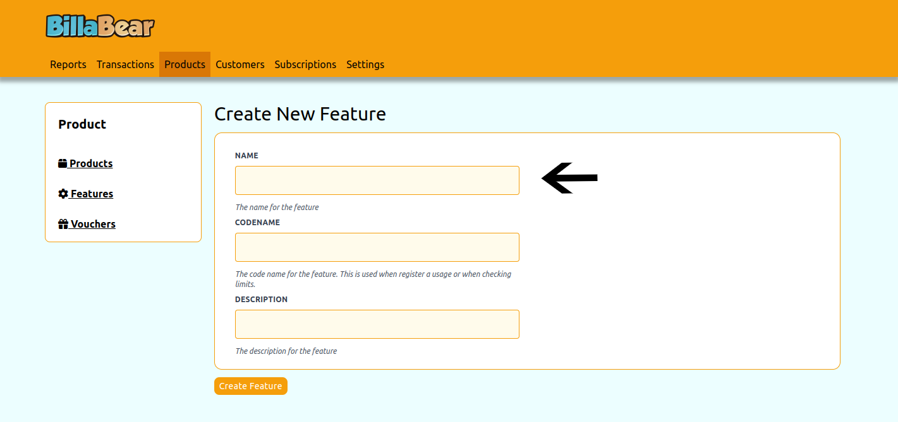
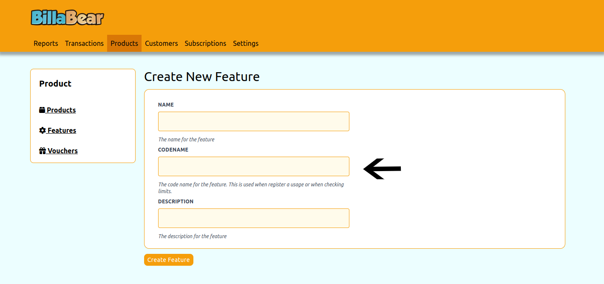
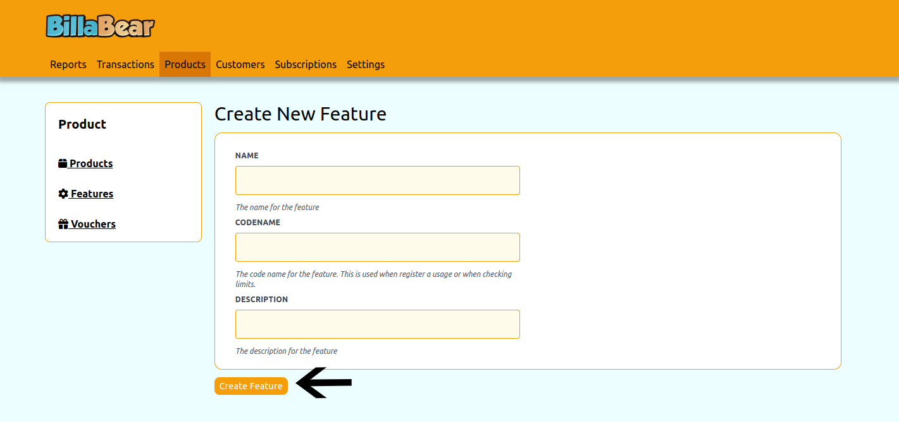

# Creating Features in BillaBear

Features are specific capabilities or aspects of your products that you can use to differentiate subscription plans and clearly communicate what customers receive. Creating features is an important step in setting up your product offerings in BillaBear.

## What is a Feature?

In BillaBear, a feature represents a specific capability, service, or aspect of your product. Features help you:

- Define what each product includes
- Create different subscription plans based on included features
- Clearly communicate to customers what they get with each plan

For example, if you sell a CRM software, features might include "Contact Management", "Email Integration", "Advanced Reporting", or "API Access".

## Required Permissions

To create features in BillaBear, you need to have a role of Account Manager or higher.

[Learn more about user roles here](../user_roles/)

## How to Create a Feature

Creating a feature in BillaBear involves a few simple steps:

### Step 1: Navigate to the Features Section and Click "Create"

From the main dashboard, navigate to the Products section, then to the Features tab, and click the "Create" button to start creating a new feature.

### Step 2: Enter the Feature Name

Enter a descriptive name for your feature. The name should clearly describe what the feature provides to customers.

**Tips for choosing a good feature name:**
- Be specific about what the feature does
- Use language your customers will understand
- Keep it concise but descriptive

### Step 3: Enter a Codename

The codename is a unique identifier for the feature that can be used in your systems or API integrations. It should be:

- Unique across all features
- Simple and without spaces (use underscores or hyphens if needed)
- Lowercase to avoid case-sensitivity issues
- Related to the feature name for easy recognition

For example, if your feature is named "Advanced Reporting", a good codename might be "advanced_reporting".

### Step 4: Click "Create" to Save the Feature

After entering the feature name and codename, click the "Create" button to save your new feature. BillaBear will create the feature and return you to the feature list.

## What's Next?

After creating features, you can:

1. **Associate Features with Products**: Add the features to your products to define what each product includes

2. **Create Subscription Plans**: Set up subscription plans that include specific features
   - Different plans can include different sets of features
   - This allows you to create tiered offerings (e.g., Basic, Professional, Enterprise)

3. **Communicate Features to Customers**: Use the features list in your marketing materials and customer portal to clearly show what each plan includes

## Managing Existing Features

Once created, you can manage your features by:
- Editing feature details
- Associating or disassociating features with products
- Including or excluding features from subscription plans

All these actions can be performed from the feature detail page, which you can access by clicking on a feature in the feature list.