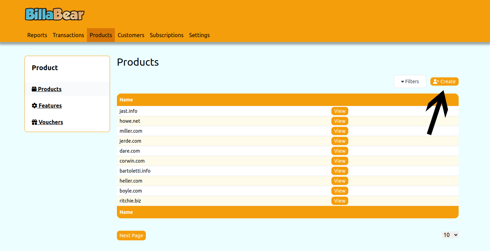
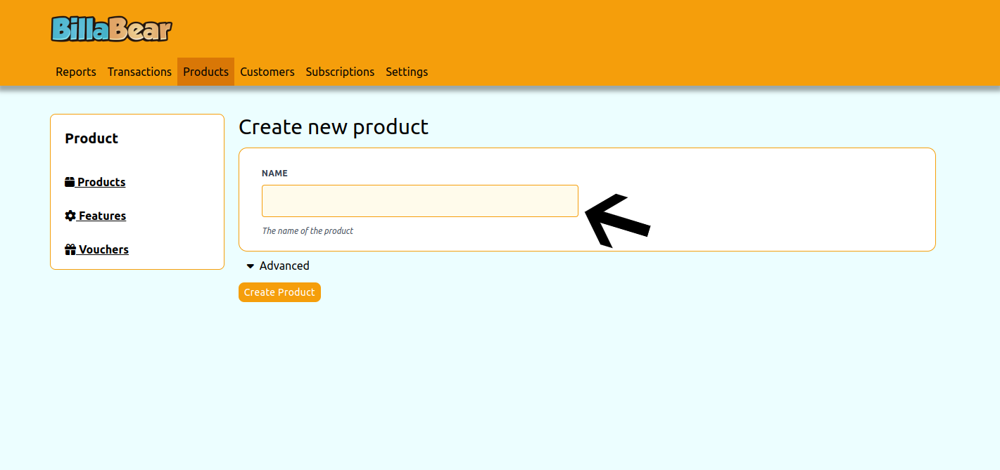
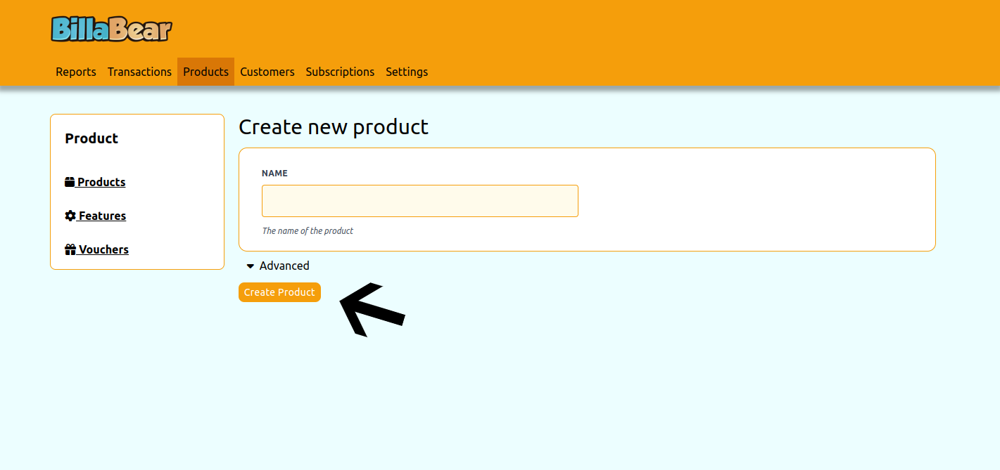

# Creating a Product in BillaBear

Products are the foundation of your offerings in BillaBear. A product represents the core item or service that you sell to your customers. Before you can set up subscription plans or define features, you need to create a product.

## What is a Product?

In BillaBear, a product serves as a container for:
- Features that describe what the product includes
- Subscription plans that determine how customers can purchase the product
- Pricing options associated with those plans

For example, if you sell software, you might create products like "Basic CRM", "Advanced CRM", and "Enterprise CRM".

## Required Permissions

To create a product in BillaBear, you need to have a role of Account Manager or higher.

[Learn more about user roles here](../user_roles/)

## How to Create a Product

Creating a product in BillaBear is a simple process that requires only a few steps:

### Step 1: Navigate to the Products Section and Click "Create"

From the main dashboard, navigate to the Products section and click the "Create" button to start creating a new product.

### Step 2: Enter the Product Name

Enter a descriptive name for your product. Choose a name that clearly identifies what the product is and distinguishes it from other products you might offer.

**Tips for choosing a good product name:**
- Keep it concise but descriptive
- Make it easy to understand for your customers
- Ensure it reflects the value or purpose of the product

### Step 3: Click "Create" to Save the Product

After entering the product name, click the "Create" button to save your new product. BillaBear will create the product and return you to the product list.

## What's Next?

After creating a product, you can:

1. **Add Features**: Define what capabilities or aspects your product includes
   - [Learn how to create features](./create_feature.md)

2. **Create Subscription Plans**: Set up how customers can subscribe to your product
   - This includes defining billing periods, pricing, and which features are included

3. **Set Pricing**: Determine how much to charge for your product under different subscription plans
   - BillaBear supports various pricing models including fixed price, per-unit, and tiered pricing

## Managing Existing Products

Once created, you can manage your products by:
- Editing product details
- Adding or removing features
- Creating new subscription plans
- Adjusting pricing
- Viewing product performance metrics

All these actions can be performed from the product detail page, which you can access by clicking on a product in the product list.