# Creating Quotes

Creating quotes that customers can accept at their leisure is an important part of the sales process. Quotes allow you to provide formal pricing information to potential customers before they commit to a purchase.

## Permissions

To create quotes for customers via the BillaBear admin system, you need to have a ROLE of Account Manager or higher.

[Check the user roles here.](../user_roles/)

## Video Demonstration

You can watch a video demonstration of the quotes feature here: [BillaBear Quotes Demonstration](https://www.youtube.com/watch?v=MgSPPSCz2D8)

## Step-by-Step Guide to Creating a Quote

### Step 1. Click Invoices

First, navigate to the Invoices section in the main menu.

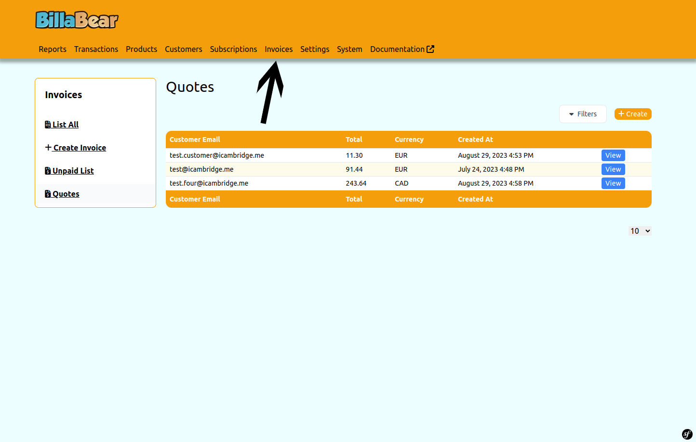

### Step 2. Click Quotes

From the Invoices section, select the Quotes tab to access the quotes management area.

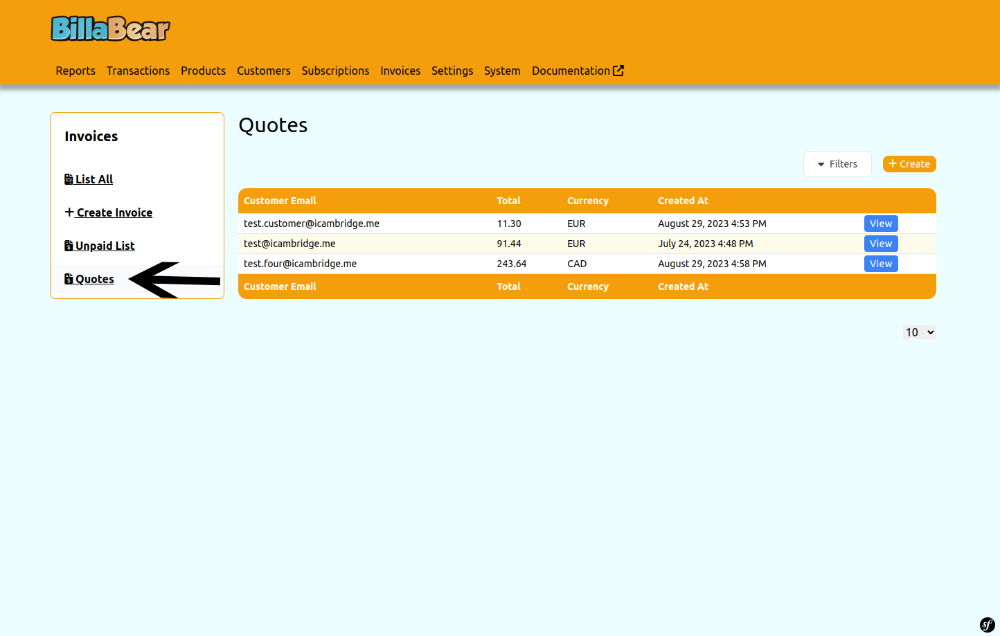

### Step 3. Click Create

Click the Create button to start creating a new quote.

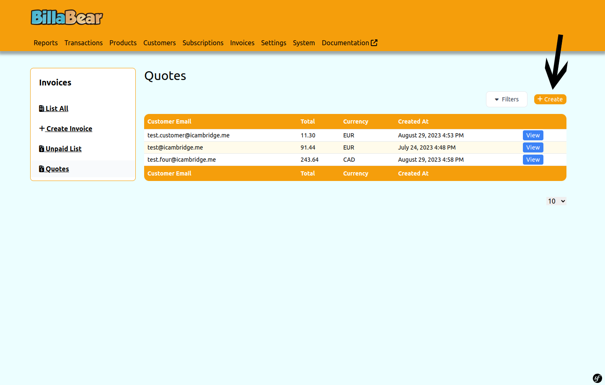

### Step 4. Select a Customer

Enter and select the customer for whom you're creating the quote. This will be the recipient of the quote.

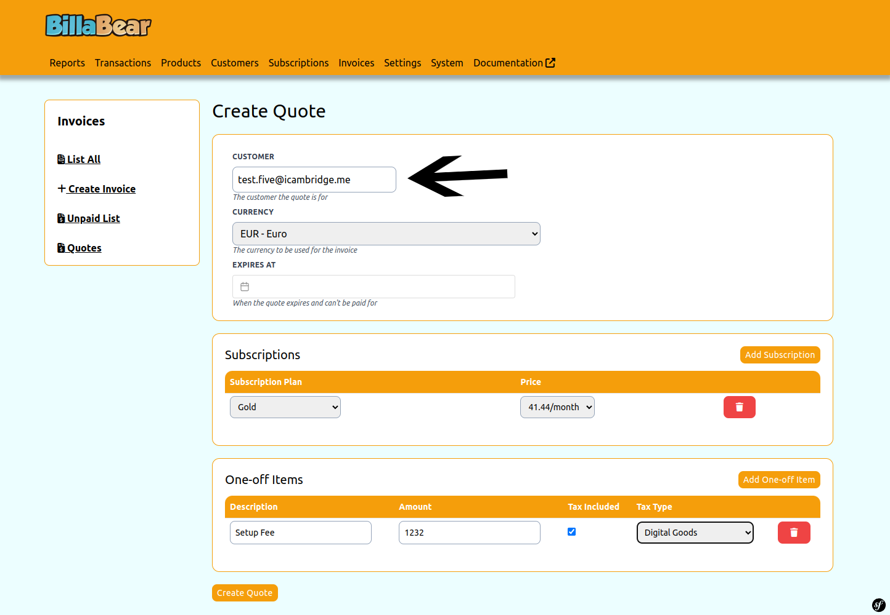

### Step 5. Select Currency

Choose the currency for the quote. All items in the quote will use this currency.

### Step 6. Add Subscription (Optional)

If the quote includes a subscription, click the "Add Subscription" button. You can add multiple subscriptions to a single quote if needed.

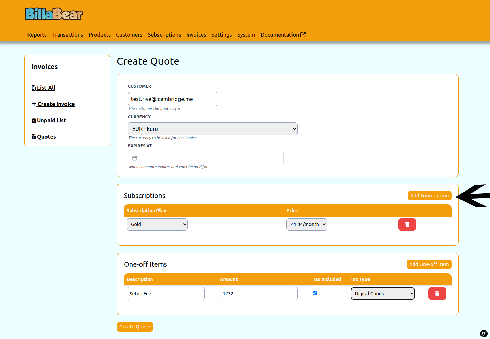

### Step 7. Select Plan

If you're adding a subscription, select the subscription plan you want to offer to the customer.

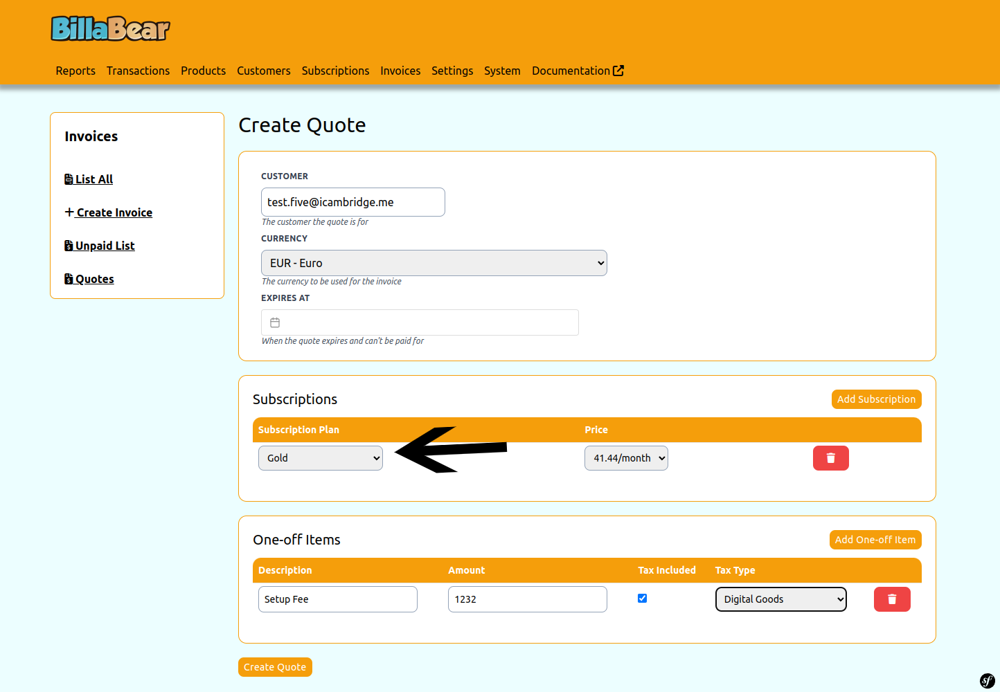

### Step 8. Select Price

Choose the appropriate pricing option for the selected subscription plan.

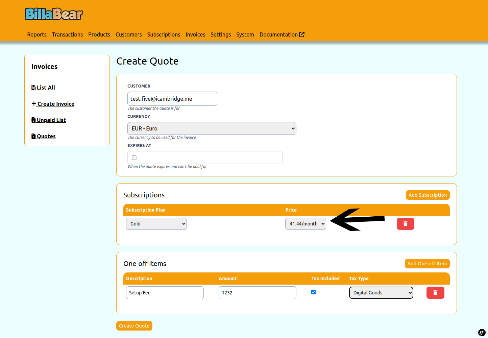

### Step 9. Add One-off Item (Optional)

If you want to include a one-time charge in the quote, click the "Add One-off Item" button. You can add multiple one-off items to a single quote.

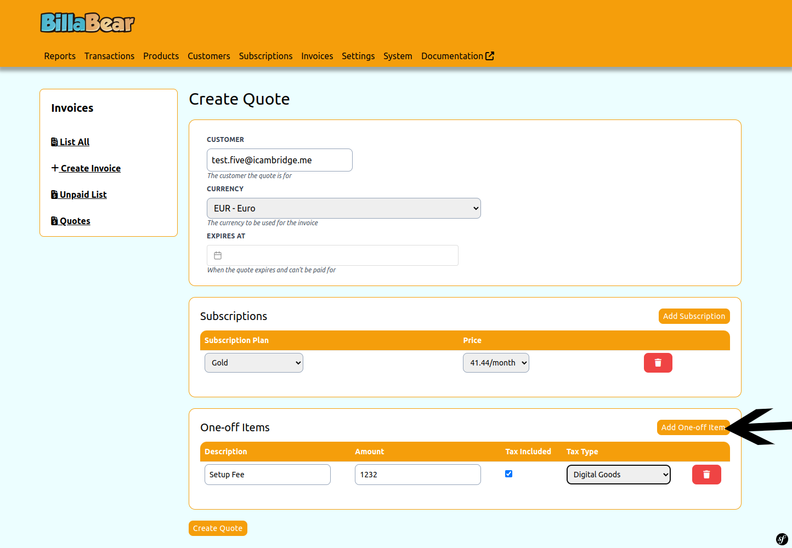

### Step 10. Enter Description

For one-off items, enter a clear description of what the item is. This will appear on the quote and any resulting invoices.

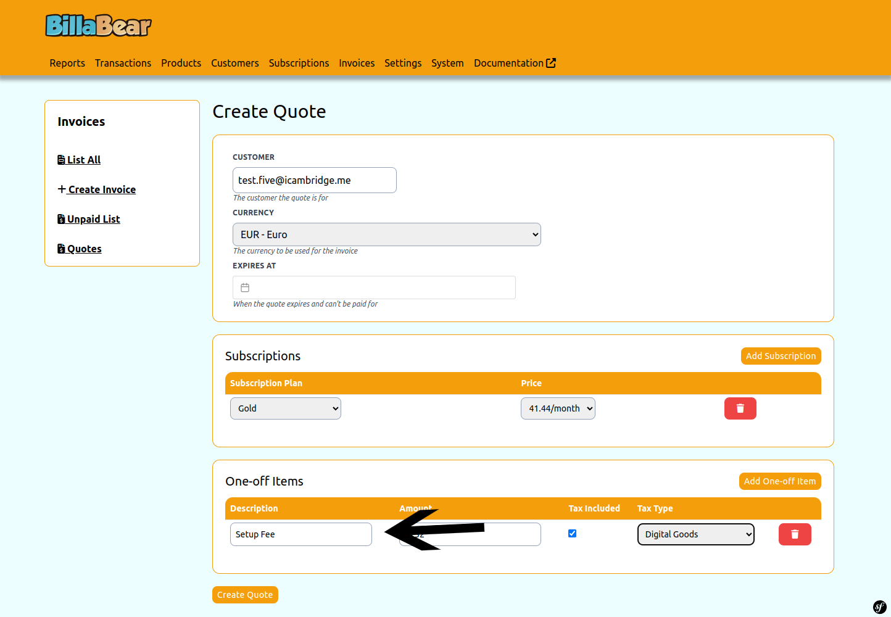

### Step 11. Enter Amount

Specify the amount to charge for the one-off item.

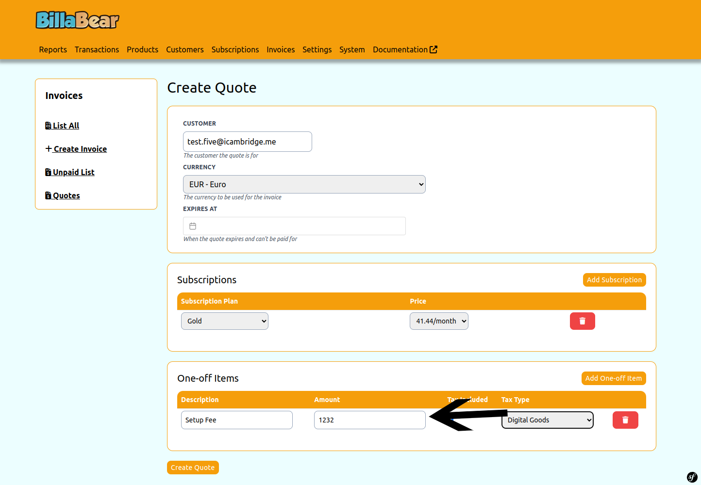

### Step 12. Set Tax Status

Determine whether the item should include tax or not. This affects how tax is calculated and displayed on the quote.

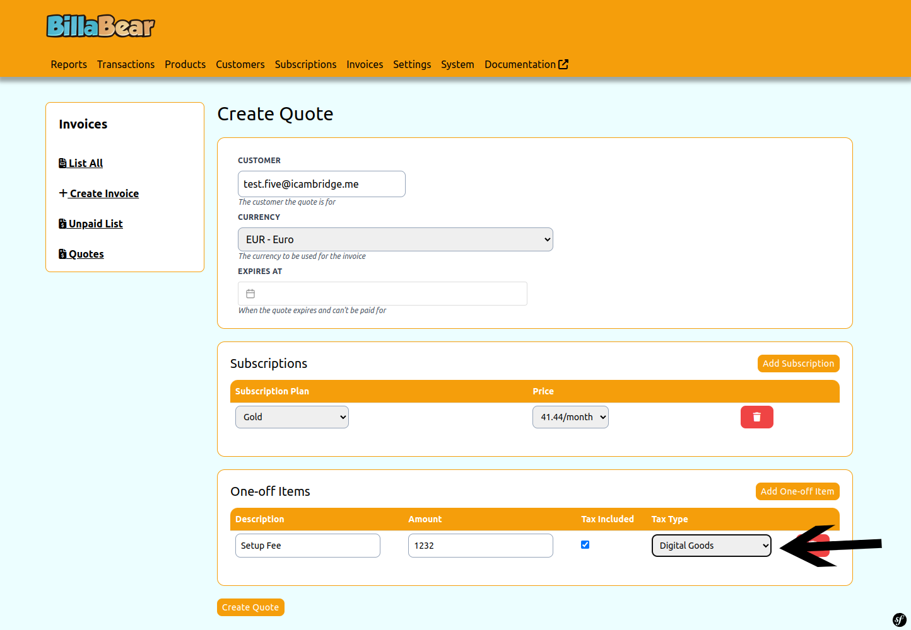

### Step 13. Click Create

After adding all the desired items to the quote and reviewing the information, click the Create button to generate the quote.

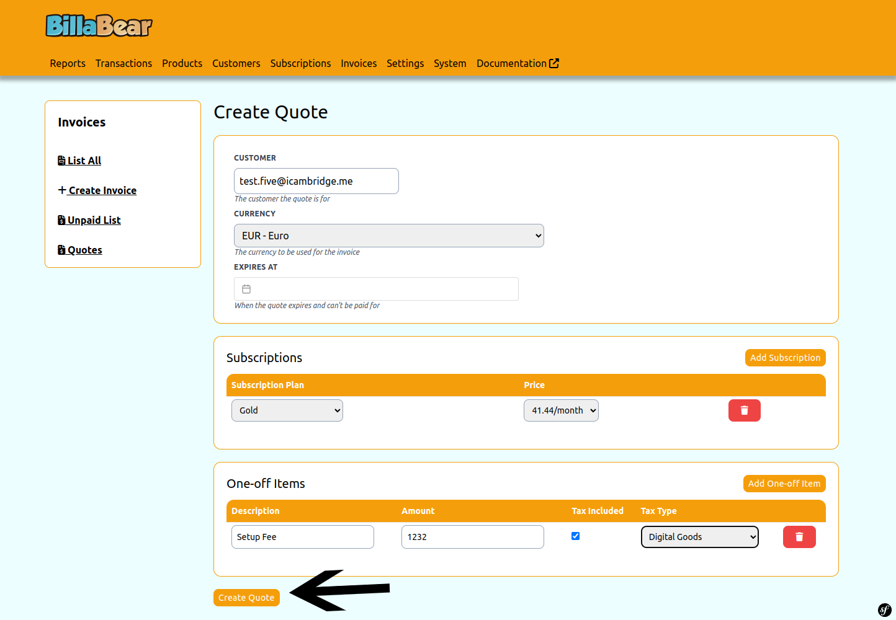

## What Happens Next

After creating a quote:

1. The quote is saved in the system and assigned a unique identifier
2. You can view the quote in the quotes list
3. You can share the quote with the customer for their review
4. The customer can accept the quote, which will initiate the subscription and/or generate invoices for one-off items
5. You can track the status of the quote to see if it has been accepted, expired, or is still pending

## Tips for Creating Effective Quotes

- **Be Clear and Specific**: Provide detailed descriptions for all items in the quote
- **Include All Relevant Items**: Make sure the quote includes all products or services the customer has expressed interest in
- **Check Pricing Carefully**: Verify that all prices are correct before creating the quote
- **Consider Tax Implications**: Set the appropriate tax status for each item based on your tax requirements
- **Review Before Sending**: Double-check all information before sharing the quote with the customer