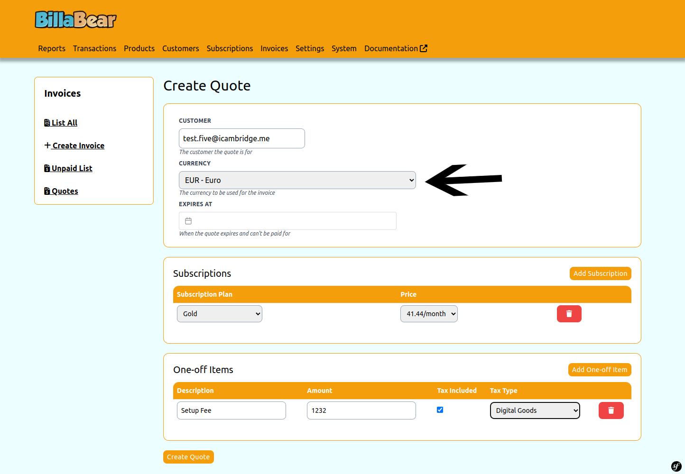

Creating quotes that customers can accept at their leasure is an important part of the sales process.

## Permissions

To be able to create quote for a customer via the BillaBear admin system you will need to have a ROLE of Account Manager or higher.

[Check the user roles here.](../user_roles/)

## How To

### Video

You can check out a video demostration of the quotes - https://www.youtube.com/watch?v=MgSPPSCz2D8

### Step 1. Click Invoices

### Step 2. Click Quotes

### Step 3. Click Create

### Step 4. Input a customer

### Step 5. Select currency

### Step 6. Add subscription

### Step 7. Select Plan

### Step 8. Select Price

### Step 9. Add One-off Item

### Step 10. Enter Description

### Step 11. Enter Amount

### Step 12. Decide tax

### Step 13. Click Create

