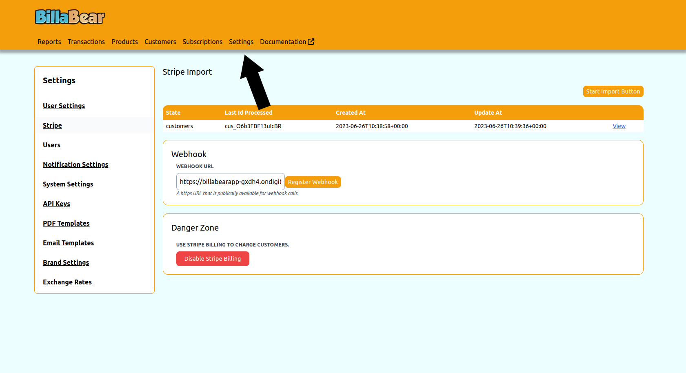
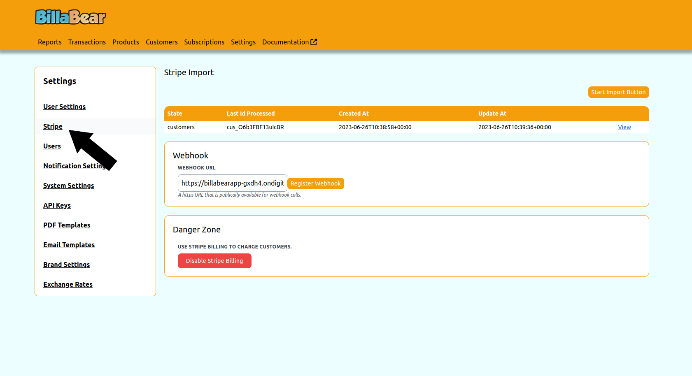
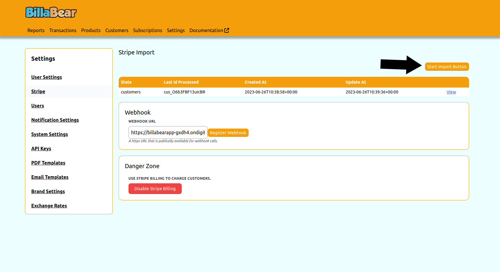
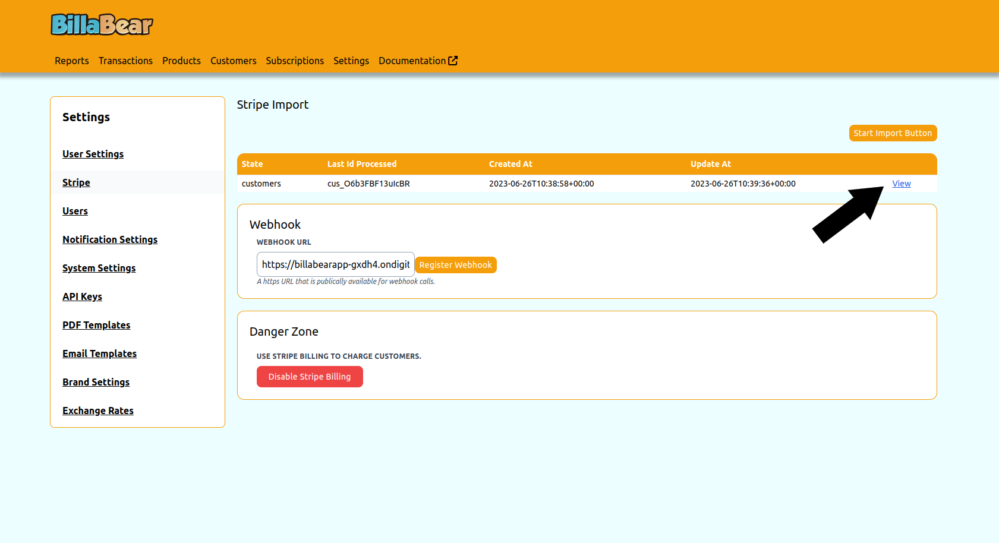
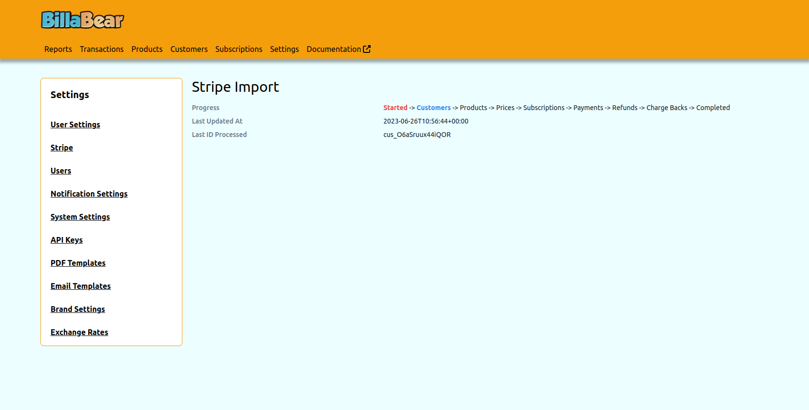

One of the first things you need to do when using a pre-existing system is import your stripe data.

## Permissions

To be able to toogle a customer's status the BillaBear admin system you will need to have a ROLE of Admin or higher.

[Check the user roles here.](../user_roles/)

## How It Works

The import process goes

* Customers
* Products
* Prices
* Subscriptions
* Payments
* Refunds
* Charge Backs

## How to

### Step 1. Click Settings

### Step 2. Click Stripe

### Step 3. Click Start

### Step 4. Click View

### Step 5. Watch Progress

