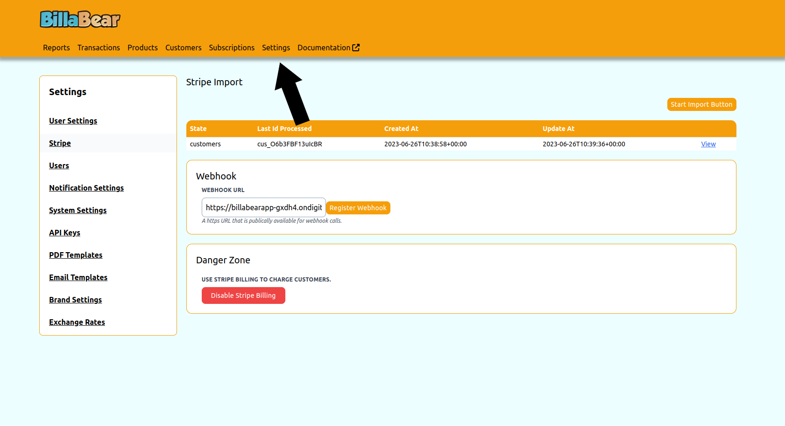

# Configure Stripe Settings

Properly configuring your Stripe settings in BillaBear is essential for successful payment processing and subscription management. This guide will help you set up and manage your Stripe integration.

## Prerequisites

Before configuring Stripe settings, ensure you have:

- An active Stripe account
- Access to your Stripe API keys
- Administrator access to BillaBear

## Required Permissions

To configure Stripe settings in BillaBear, you need to have an **Admin** role or higher.

[Learn more about user roles here](../user_roles/)

## Accessing Stripe Settings

1. Log in to your BillaBear account
2. Click on **Settings** in the main navigation menu
3. Select **Stripe** from the settings menu

## API Configuration

### Adding Your Stripe API Keys

BillaBear requires your Stripe API keys to communicate with your Stripe account:

1. In the Stripe settings page, locate the **API Configuration** section
2. Enter your **Publishable Key** from your Stripe dashboard
3. Enter your **Secret Key** from your Stripe dashboard
4. Click **Save** to store your API keys

### Test Mode vs. Live Mode

BillaBear supports both test and live modes for Stripe:

- **Test Mode**: Use Stripe's test environment for testing without processing real payments
- **Live Mode**: Process real payments in your production environment

To switch between modes:

1. In the Stripe settings page, find the **Environment** toggle
2. Select **Test** or **Live** as needed
3. Ensure you've entered the appropriate API keys for the selected environment

## Enabling/Disabling Stripe Billing

You can control whether BillaBear uses Stripe for billing:

1. In the Stripe settings page, locate the **Billing Integration** section
2. Click the **Enable** button to activate Stripe billing
3. Click the **Disable** button to deactivate Stripe billing

When Stripe billing is disabled, BillaBear will not create or update any data in your Stripe account.

## Configuring Webhook Settings

Webhooks allow Stripe to automatically notify BillaBear about events (like successful payments or subscription updates):

1. In the Stripe settings page, find the **Webhook Configuration** section
2. Click **Register Webhook** to automatically set up the webhook in your Stripe account
3. BillaBear will display the webhook URL and signing secret

For more detailed information about webhooks, see the [Webhooks documentation](./webhooks).

## Stripe Account Information

The Stripe settings page displays information about your connected Stripe account:

- **Account Name**: The name of your Stripe account
- **Account Status**: Whether your account is active and properly connected
- **Connection Status**: The status of the connection between BillaBear and Stripe

## Import Status

If you've imported data from Stripe, the settings page will show:

- **Last Import Date**: When you last imported data from Stripe
- **Import Status**: Whether the import is complete, in progress, or failed
- **View Import**: Link to view detailed import progress

For more information about importing data, see the [Import Data documentation](./import).

## Troubleshooting

If you encounter issues with your Stripe configuration:

- **Invalid API Keys**: Ensure you've entered the correct API keys for your selected environment
- **Connection Issues**: Check your internet connection and Stripe's status page
- **Webhook Failures**: Verify that your webhook URL is accessible from the internet

For more detailed troubleshooting, see the [Troubleshooting documentation](./troubleshooting).

## Best Practices

- **Regularly Update API Keys**: If you rotate your Stripe API keys, update them in BillaBear immediately
- **Test Before Going Live**: Always test your configuration in test mode before processing real payments
- **Monitor Webhook Events**: Regularly check that webhook events are being received correctly
- **Keep Environments Separate**: Use different BillaBear instances for test and live environments if possible