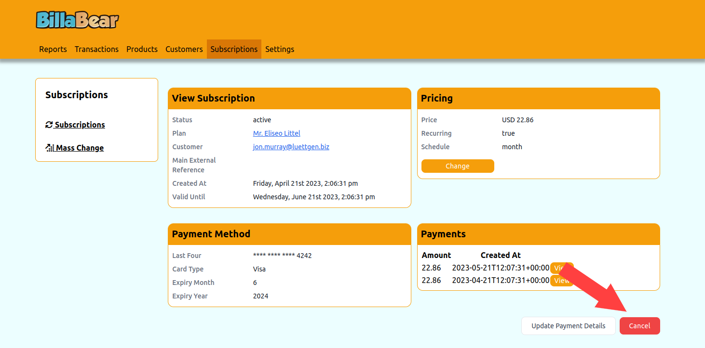
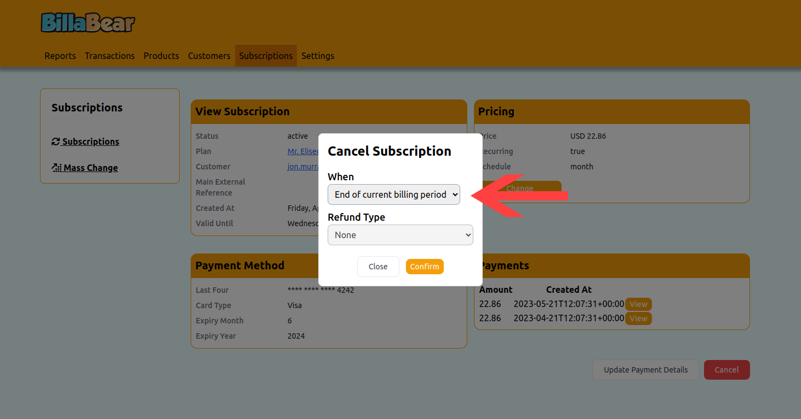
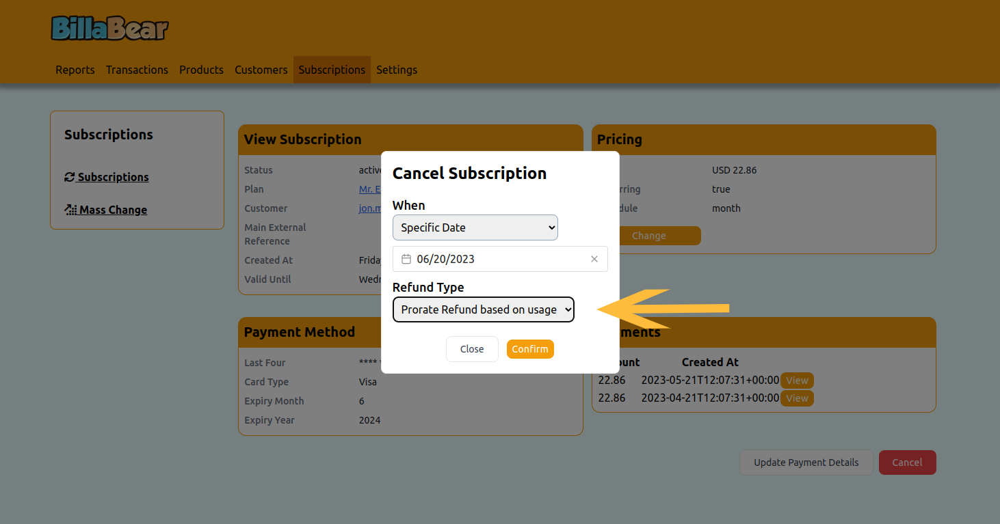
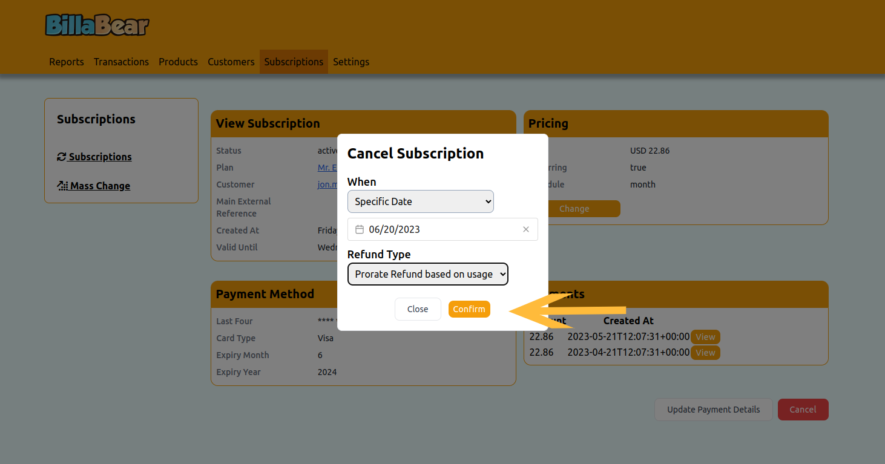

# Cancelling a Subscription

Subscription cancellation is an important part of managing customer relationships. BillaBear provides flexible options to handle different cancellation scenarios while maintaining clear records for reporting and analytics.

## Understanding Subscription Cancellation

When a customer wishes to end their subscription, you need to process this request in BillaBear. Cancellation doesn't always mean immediate termination - you have options for when the cancellation takes effect and how to handle any refunds.

## Required Permissions

To cancel a subscription in BillaBear, you need to have the role of **Customer Support** or higher.

For more information about user roles and permissions, see the [User Roles documentation](../user_roles/).

## Cancellation Timing Options

BillaBear offers three options for when a cancellation takes effect:

### Instantly

The subscription ends immediately. The customer loses access to the subscribed products or services right away.

**When to use**: 
- When a customer requests immediate cancellation
- When there are policy violations
- When immediate termination is required for legal or compliance reasons

### Defined Date

The subscription ends on a specific date that you choose. The customer maintains access until that date.

**When to use**:
- When a customer has a contractual end date
- When you want to align the cancellation with a specific event
- When you need to provide a specific notice period

### End of Billing Period

The subscription continues until the end of the current billing period, then does not renew. The customer maintains access until the end of what they've already paid for.

**When to use**:
- When a customer has already paid for the current period
- When you want to provide the best customer experience
- When your terms of service specify this approach

## Refund Options

When cancelling a subscription, you can choose to issue a refund. BillaBear offers two types of refunds:

### Full Refund

A full refund returns the entire amount of the most recent payment for the subscription.

**When to use**:
- When a customer is dissatisfied with the service
- When there was a billing error
- When required by your refund policy

### Pro-rata Refund

A pro-rata (proportional) refund returns a portion of the most recent payment based on the unused time remaining in the billing period. BillaBear automatically calculates the correct amount based on:

- **Weekly subscriptions**: Divides the payment by 7 to find the daily rate, then multiplies by the number of days remaining
- **Monthly subscriptions**: Divides the payment by the number of days in the current month to find the daily rate, then multiplies by the number of days remaining
- **Yearly subscriptions**: Divides the payment by 365 to find the daily rate, then multiplies by the number of days remaining

**When to use**:
- When a customer has used the service for part of the billing period
- When you want to be fair to both the customer and your business
- When your terms of service specify this approach

## Step-by-Step Guide to Cancelling a Subscription

### Step 1: Navigate to the Subscription View Page

First, you need to access the subscription you want to cancel. See [View Subscription](./view_subscription) for detailed instructions on how to find and view a subscription.

### Step 2: Click the "Cancel" Button

On the subscription view page, locate and click the "Cancel" button.

### Step 3: Choose When to Cancel

Select when you want the cancellation to take effect: instantly, on a specific date, or at the end of the billing period.

### Step 4: Choose Refund Type

Select whether to issue no refund, a full refund, or a pro-rata refund.

### Step 5: Confirm the Cancellation

Review your selections and click "Confirm" to process the cancellation.

## What Happens After Cancellation

After you cancel a subscription:

1. **Subscription Status**: The subscription status changes to "Cancelled" in BillaBear.

2. **Access**: 
   - For instant cancellations: The customer loses access immediately
   - For defined date cancellations: The customer maintains access until the specified date
   - For end-of-billing-period cancellations: The customer maintains access until the end of the current billing period

3. **Refunds**: If you selected a refund option, BillaBear processes the refund automatically.

4. **Notifications**: The customer typically receives an email notification about the cancellation (depending on your notification settings).

5. **Reporting**: The cancellation is recorded in your subscription metrics and reports.

## Reactivating a Cancelled Subscription

If a customer changes their mind after cancellation, you can:

- Create a new subscription for the customer (recommended for most cases)
- Contact your system administrator for assistance with reactivation in special cases

## Troubleshooting

### Common Issues

- **Refund Failures**: If a refund fails to process, check the payment provider's status and try again.

- **Access Issues**: If a customer reports access problems after cancellation, verify the cancellation timing settings.

### Need Help?

If you encounter any issues while cancelling a subscription, please contact your system administrator or refer to the [BillaBear documentation](../) for more information.