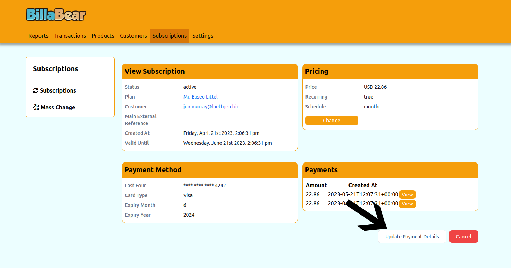
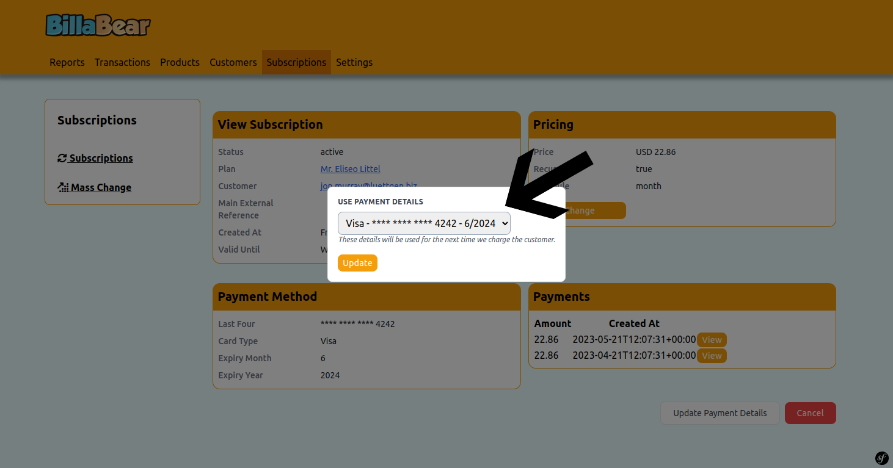
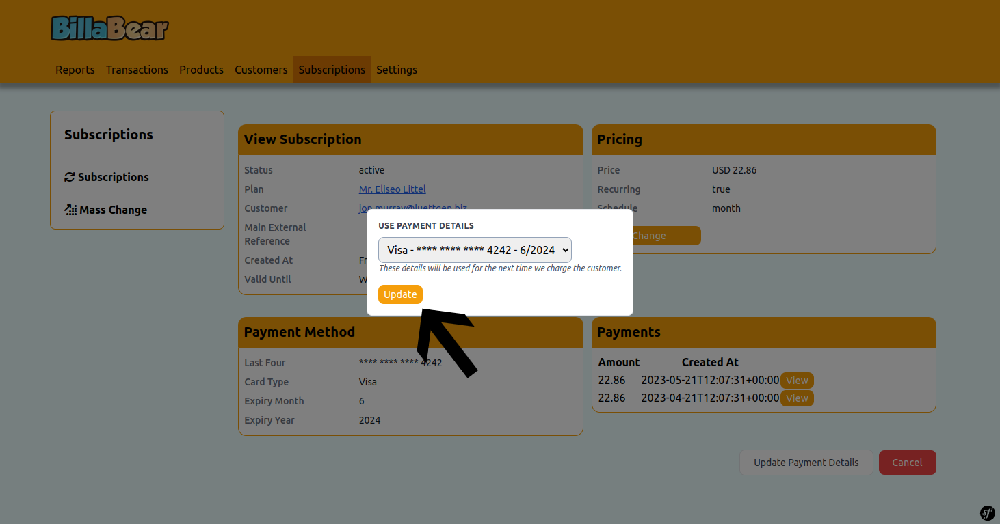

# Changing Subscription Payment Details

Updating the payment method for a customer's subscription is a common customer service task. BillaBear makes this process straightforward and efficient.

## Understanding Payment Details Changes

When a customer needs to update their payment method (for example, when they get a new credit card or want to switch from credit card to bank transfer), you can update the payment details associated with their subscription. This ensures that future billing attempts use the correct payment method.

## Required Permissions

To change payment details for a subscription in BillaBear, you need to have the role of **Customer Support** or higher.

For more information about user roles and permissions, see the [User Roles documentation](../user_roles/).

## How Payment Detail Changes Work

When you change the payment details for a subscription:

- The new payment method will be used for all future payment attempts
- Any pending or scheduled invoices will use the new payment method
- The change takes effect immediately
- The old payment method remains in the customer's account but won't be used for this subscription unless selected again

## Step-by-Step Guide to Changing Payment Details

### Step 1: Navigate to the Subscription View Page

First, you need to access the subscription for which you want to change the payment details. See [View Subscription](./view_subscription.md) for detailed instructions on how to find and view a subscription.

### Step 2: Click "Update Payment Details"

On the subscription view page, locate and click the "Update Payment Details" button.

### Step 3: Select New Payment Details

Choose the new payment method from the available options. This could be:

- An existing payment method already on file for the customer
- A new payment method that you add during this process

If the customer doesn't have any other payment methods on file, you'll need to add a new one.

### Step 4: Click "Update"

Review your selection and click the "Update" button to save the changes.

## What Happens After Changing Payment Details

After you update the payment details for a subscription:

1. **Immediate Effect**: The change takes effect immediately.

2. **Future Billing**: All future invoices and payment attempts will use the new payment method.

3. **Pending Invoices**: Any unpaid invoices will attempt payment using the new payment method.

4. **No Immediate Charge**: Changing the payment method does not trigger an immediate payment unless there are unpaid invoices.

5. **Record Keeping**: The change is recorded in the subscription's history for audit purposes.

## Common Scenarios

### Expired Credit Card

When a customer's credit card expires:

1. Navigate to the subscription
2. Update the payment details with the new card information
3. If there are any failed payments due to the expired card, you may need to retry those payments

### Switching Payment Methods

When a customer wants to switch from one payment method to another (e.g., from credit card to bank transfer):

1. Ensure the new payment method is added to the customer's account
2. Navigate to the subscription
3. Update the payment details to use the new payment method

## Troubleshooting

### Common Issues

- **Payment Method Not Available**: If you don't see the expected payment method in the list, check that it has been properly added to the customer's account.

- **Update Failed**: If the update fails, check that the payment method is valid and try again.

### Need Help?

If you encounter any issues while changing payment details, please contact your system administrator or refer to the [BillaBear documentation](../) for more information.