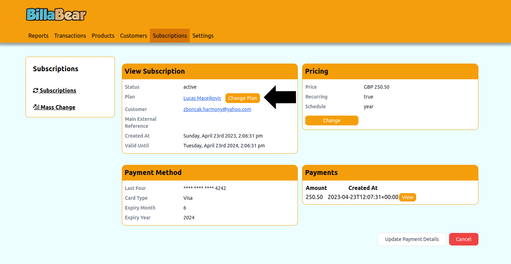

# Changing a Subscription Plan

Changing a customer's subscription plan is a common task when customers want to upgrade, downgrade, or switch to a different service offering. BillaBear makes this process straightforward while giving you control over when the change takes effect.

## Understanding Plan Changes

A plan change moves a customer from one subscription plan to another. This might involve:
- Upgrading to a higher-tier plan with more features
- Downgrading to a lower-tier plan with fewer features
- Switching to a different plan with a different set of features

## Required Permissions

To change a subscription plan in BillaBear, you need to have the role of **Customer Support** or higher.

For more information about user roles and permissions, see the [User Roles documentation](../user_roles/).

## How Plan Changes Work

When you change a subscription plan:

- The customer's access to features may change based on the new plan
- The price typically changes to match the new plan's pricing
- You can choose when the change takes effect (immediately or at the next billing cycle)
- The billing schedule (weekly, monthly, yearly) remains the same
- The currency remains the same

BillaBear does not automatically issue refunds for plan changes. If you want to issue a refund for the difference between the old and new plans, you'll need to do that separately.

## Step-by-Step Guide to Changing a Subscription Plan

### Step 1: Navigate to the Subscription View Page

First, you need to access the subscription for which you want to change the plan. See [View Subscription](./view_subscription.md) for detailed instructions on how to find and view a subscription.

### Step 2: Click "Change"

On the subscription view page, locate and click the "Change" button.

### Step 3: Select When the Change Should Take Effect

Choose when you want the plan change to take effect:
- **Immediately**: The plan changes right away
- **Next Billing Cycle**: The plan changes when the current billing period ends

### Step 4: Select the New Plan

Choose the new subscription plan from the dropdown menu. This determines what products or services the customer will receive after the change.

### Step 5: Select the Price

Choose the appropriate price for the new plan. The available prices will depend on the selected plan and must match the customer's existing billing cycle and currency.

### Step 6: Click "Update"

Review all the information and click the "Update" button to confirm the plan change.

## What Happens After Changing a Plan

After you change a subscription plan:

1. **Access Changes**: The customer's access to features changes according to the new plan.

2. **Billing Changes**:
   - For immediate changes: A pro-rated invoice may be generated for the remainder of the current billing period
   - For next-cycle changes: The new price will be applied at the next billing date

3. **Notification**: The customer typically receives an email notification about the plan change (depending on your notification settings).

4. **Record Keeping**: The change is recorded in the subscription's history for audit purposes.

## Common Scenarios

### Upgrading a Plan

When a customer wants to access more features or increase their usage limits:

1. Navigate to the subscription
2. Change to a higher-tier plan
3. Consider whether to apply the change immediately (to give instant access to new features) or at the next billing cycle

### Downgrading a Plan

When a customer wants to reduce costs or doesn't need all the features of their current plan:

1. Navigate to the subscription
2. Change to a lower-tier plan
3. Consider whether to apply the change immediately or at the next billing cycle
4. Be aware that immediate downgrades typically don't generate refunds automatically

## Troubleshooting

### Common Issues

- **Plan Not Available**: If you don't see the expected plan in the list, check that it's active and compatible with the customer's billing cycle and currency.

- **Price Not Available**: If you don't see the expected price, check that it matches the customer's billing cycle and currency.

### Need Help?

If you encounter any issues while changing a subscription plan, please contact your system administrator or refer to the [BillaBear documentation](../) for more information.