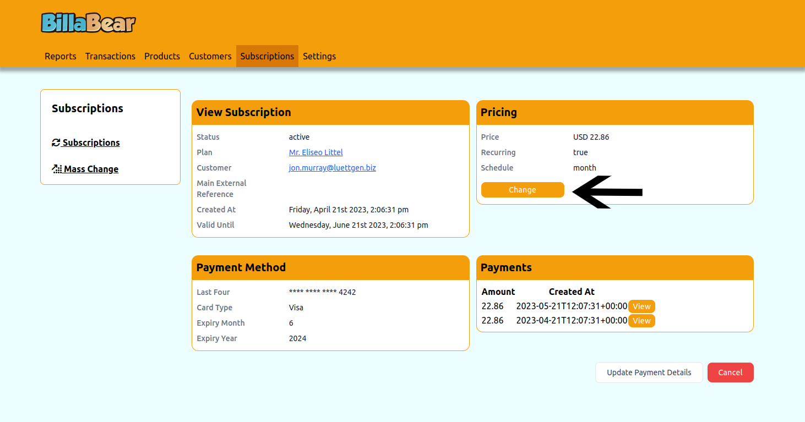
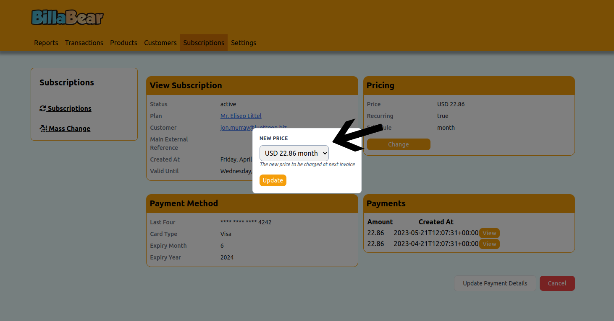
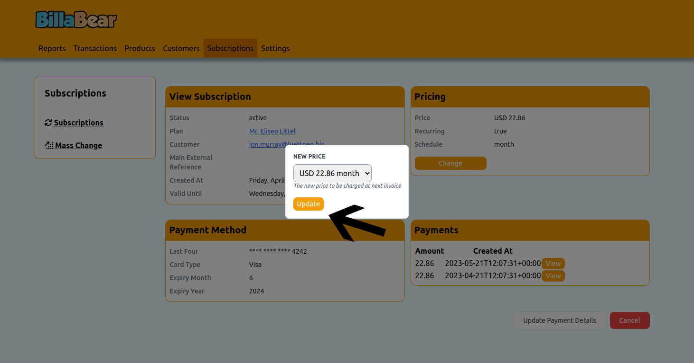

Changing the price for a customer's price is a common customer service. BillaBear makes this an easy task.

## Permissions

To be able to cancel a subscription via the BillaBear admin system you will need to have a ROLE of customer support or higher.

[Check the user roles here.](../user_roles/)

## How it works

When you change a price for a subscription the new price will be used at the next billing cycle. 

If you want to issue a refund for the difference for the current cycle, you'll need to do that separately.

## How To

### Step 1. Go to the subscription view page 

Navigate to the subscription page  - [more info](view_subscription.md)

### Step 2. Click Change Price

### Step 3. Select Price 

### Step 4. Click Update

