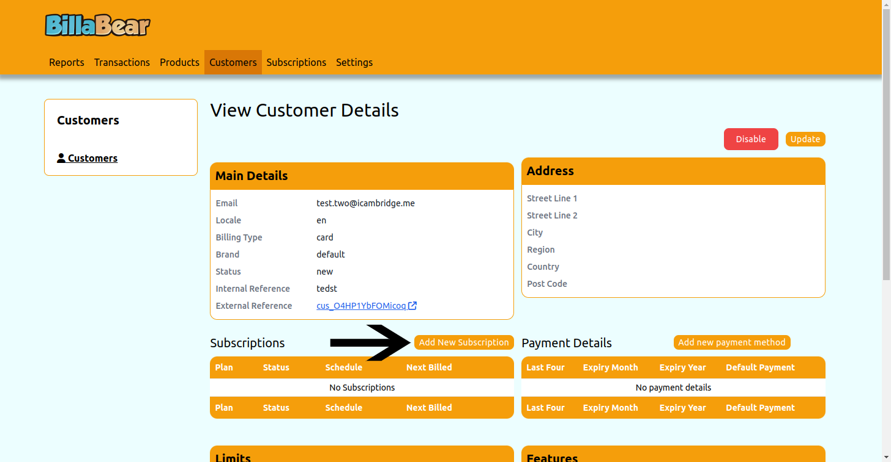
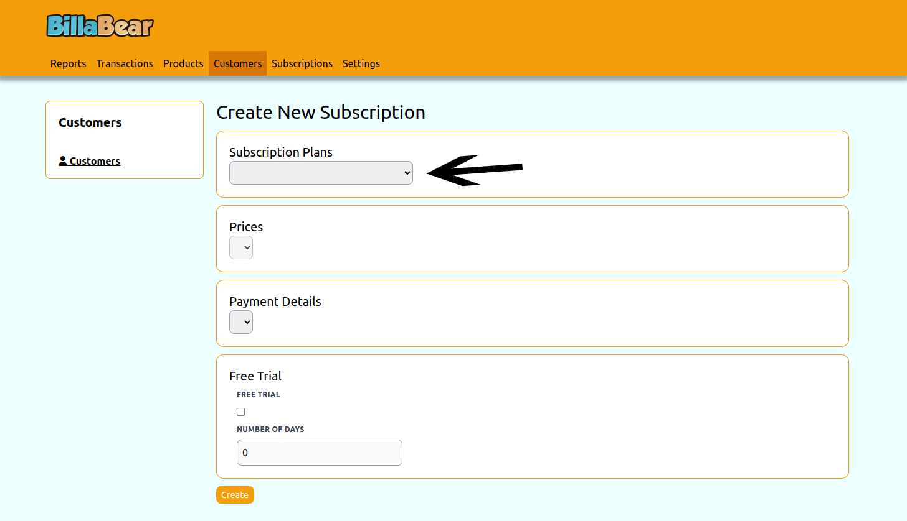
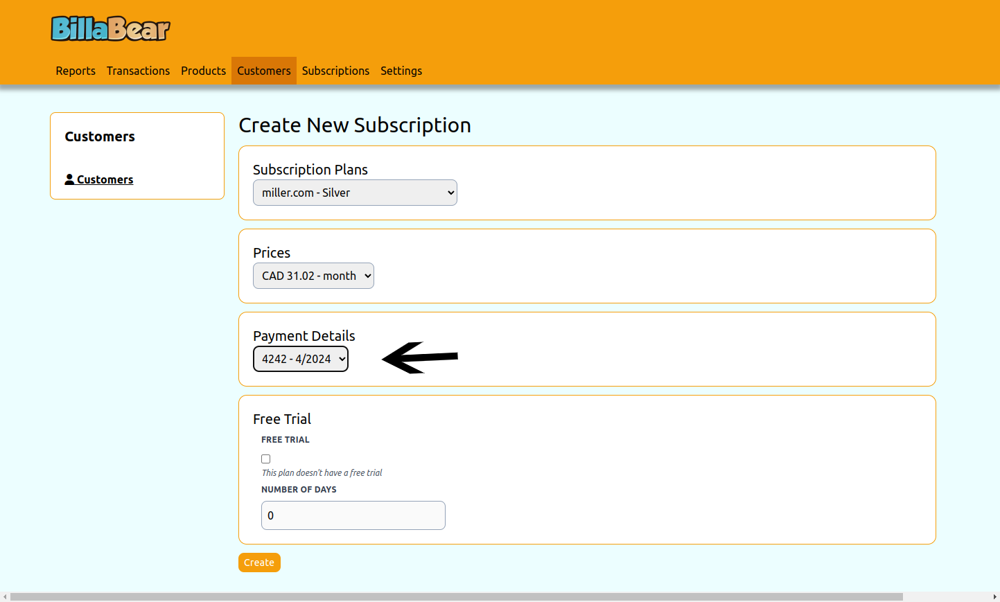
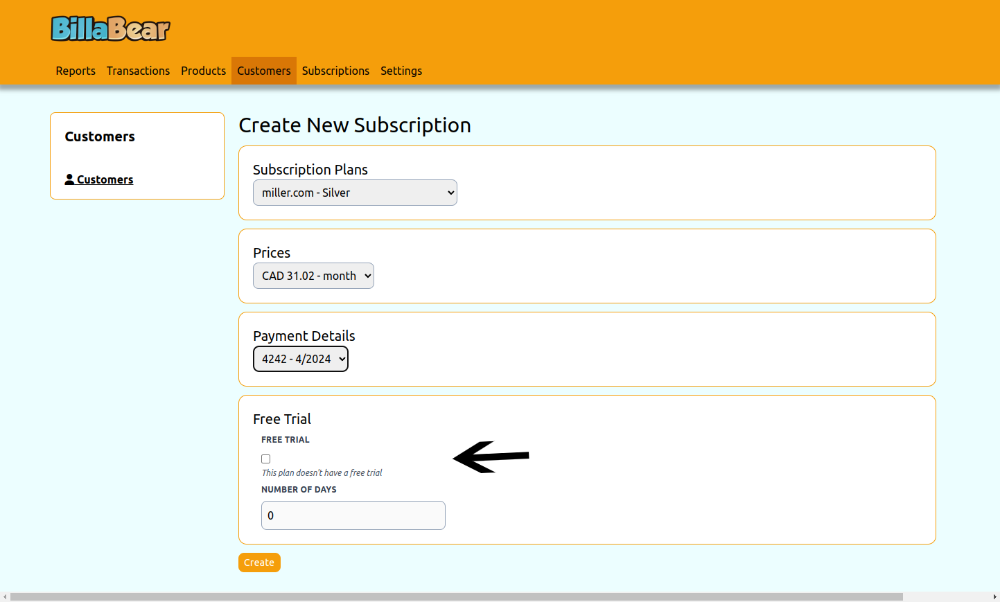
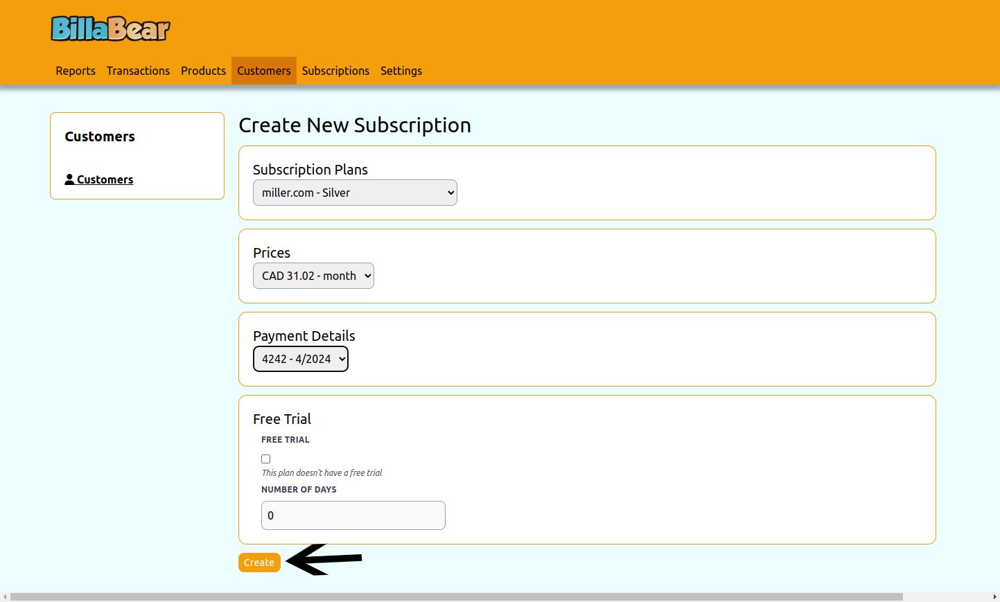

Creating a subscription is a common task for account managers when onboarding new clients. BillaBear makes this an easy task.

## Permissions

To be able to create subscription for a customer via the BillaBear admin system you will need to have a ROLE of Account Manager or higher.

[Check the user roles here.](../user_roles/)

## How it works

If the customer does not have any other active subscriptions enabled then you're able to create a subscription for any subscription plan for any payment schedudle.

If the customer does have another active subscription then you're limited to payment schedules and currencies that match the existing subscription. BillaBear will only display eligble pricing options in the create subscription form.

When creating a subscription you can override the plan's free trial policy and give a free trial for a custom length.

## How To

### 1. Click Add Subscription

### 2. Select Subscription Plan

### 3. Select Price

### 4. Select Payment Details

### 5. Decide Trial

### 6. Click Create

