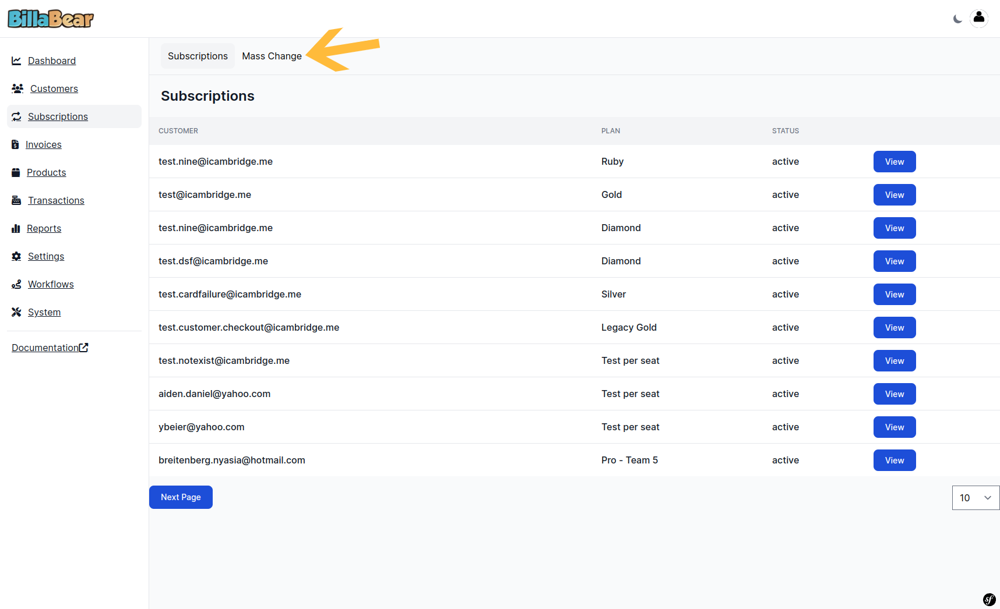
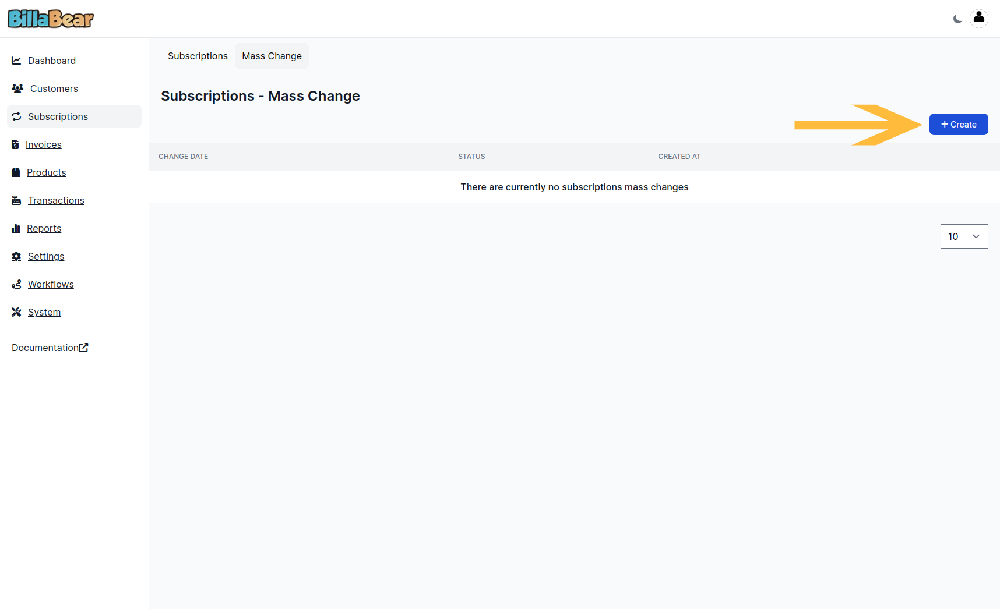
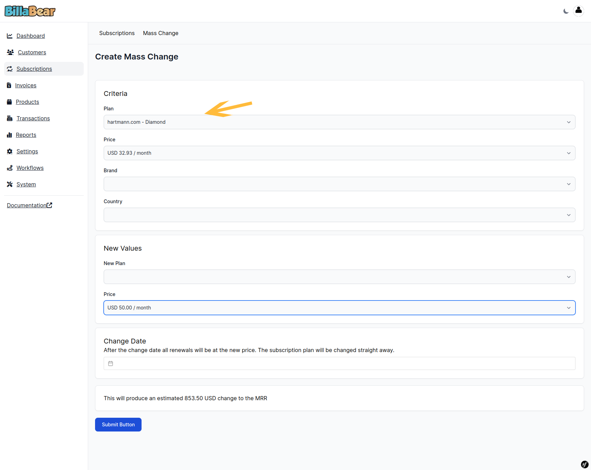
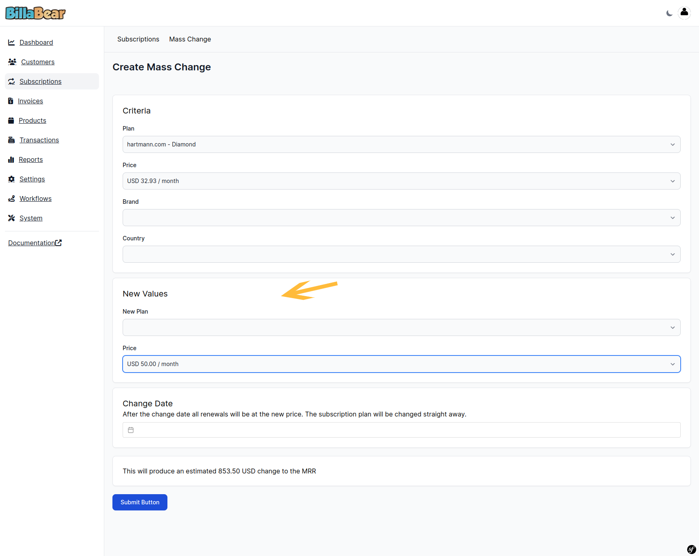
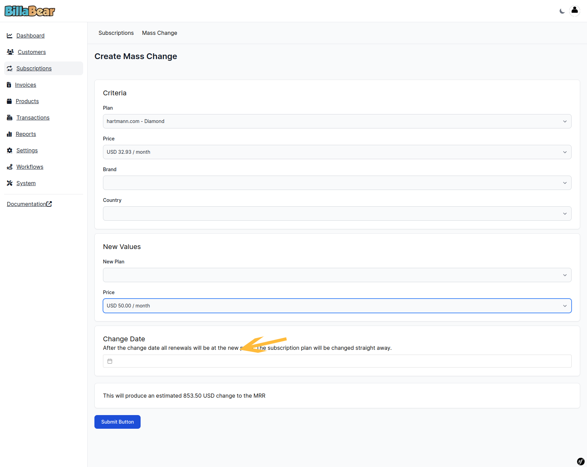
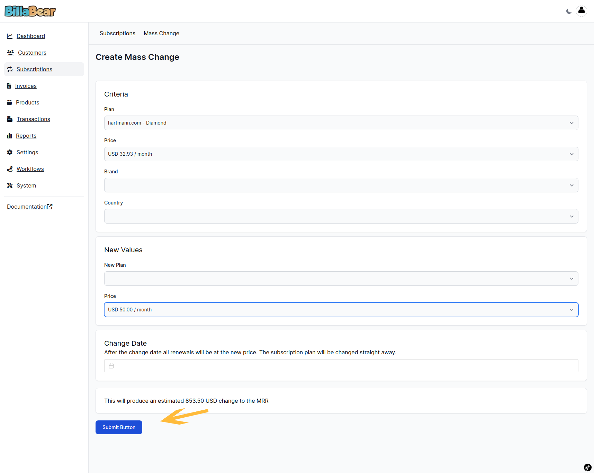

Mass changing subscriptions is a common task that companies need to need infrequently.

## Permissions

To be able to create subscription for a customer via the BillaBear admin system you will need to have a ROLE of Account Manager or higher.

[Check the user roles here.](../user_roles/)

## How it works

To do a mass-change of subscriptions you select the criteria for which subscriptions you want to have changed. The criteria include Plan, Price, Brand, and Country. 

You're able to set new values of Plan and Price.

When you change a price you'll be told of the change to the MRR.

Once a mass change has been created you're able to export the customer list to CSV. This will allow you to notify the customers via a email blast.

## Video

## How To

### 1. Click Subscription

### 2. Click Mass Change

### 3. Click Create

### 4. Select Criteria

### 5. Select new Value

### 6 Select Change Date

### 7. Click Submit

### 8. View Details

