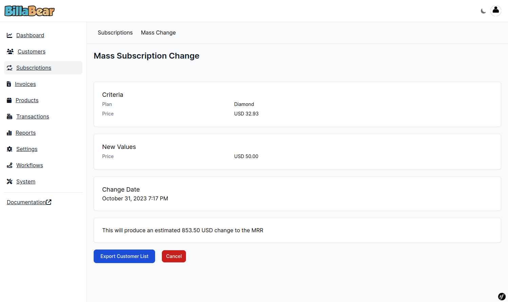

# Mass Changing Subscriptions

Mass changing subscriptions allows you to update multiple subscriptions at once, saving time and ensuring consistency when you need to make the same change to many customers. While this is not a daily task, it's an essential tool for managing subscription updates at scale.

## Understanding Mass Changes

A mass change allows you to select multiple subscriptions based on specific criteria and apply the same change to all of them at once. This is particularly useful when:

- You're updating pricing across a product line
- You're migrating customers from an old plan to a new one
- You need to make changes based on geographic regions or other customer segments

## Required Permissions

To perform mass changes to subscriptions in BillaBear, you need to have the role of **Account Manager** or higher.

For more information about user roles and permissions, see the [User Roles documentation](../user_roles/).

## How Mass Changes Work

The mass change process involves:

1. **Selecting criteria** to identify which subscriptions to change
2. **Specifying new values** for the plan and/or price
3. **Setting a change date** for when the changes should take effect
4. **Reviewing the impact** on your Monthly Recurring Revenue (MRR)
5. **Confirming the changes** to apply them to all selected subscriptions

After creating a mass change, you can export the affected customer list to a CSV file, which is useful for notifying customers about the upcoming changes.

## Selection Criteria

You can select subscriptions to change based on:

- **Plan**: Target all subscriptions on a specific plan
- **Price**: Target all subscriptions with a specific price
- **Brand**: Target all subscriptions associated with a specific brand
- **Country**: Target all subscriptions for customers in a specific country

You can combine multiple criteria to narrow down your selection.

## Step-by-Step Guide to Mass Changing Subscriptions

### Step 1: Navigate to the Subscriptions Section

Click on "Subscriptions" in the main navigation menu.

### Step 2: Click "Mass Change"

In the Subscriptions section, locate and click the "Mass Change" button or tab.

### Step 3: Click "Create"

On the Mass Change page, click the "Create" button to start a new mass change.

### Step 4: Select Criteria

Choose the criteria to determine which subscriptions will be affected by this change. You can select based on plan, price, brand, and/or country.

### Step 5: Select New Values

Specify the new plan and/or price that should be applied to the selected subscriptions. The system will show you the impact on your Monthly Recurring Revenue (MRR).

### Step 6: Select Change Date

Choose when the changes should take effect. You can schedule the change for a future date to give customers advance notice.

### Step 7: Click "Submit"

Review all the information and click the "Submit" button to create the mass change.

### Step 8: View Details

After creating the mass change, you can view its details, including the affected subscriptions and the scheduled change date.

## What Happens After Creating a Mass Change

After you create a mass change:

1. **Scheduled Changes**: The changes are scheduled to occur on the date you specified.

2. **Customer Export**: You can export a list of affected customers to CSV for notification purposes.

3. **Monitoring**: You can monitor the status of the mass change to see when it's completed.

4. **Automatic Processing**: BillaBear automatically processes the changes on the scheduled date without requiring further action from you.

## Best Practices for Mass Changes

### Communication

Always notify customers in advance of any changes to their subscriptions, especially price increases. The exported customer list makes it easy to:

- Send targeted email communications
- Provide adequate notice based on your terms of service
- Explain the reasons for the change
- Address any questions or concerns

### Timing

Consider the timing of your mass changes:

- Schedule changes to coincide with natural billing cycles when possible
- Avoid making changes during peak business periods
- Allow enough time for customer communications before changes take effect

### Testing

Before making large-scale changes:

- Test with a small subset of subscriptions first
- Verify that the changes have the expected effect
- Check that billing systems process the changes correctly

## Troubleshooting

### Common Issues

- **No Subscriptions Found**: If no subscriptions match your criteria, try broadening your selection parameters.

- **Change Not Applied**: If changes don't appear to be applied on the scheduled date, check the mass change status for any error messages.

### Need Help?

If you encounter any issues while performing mass changes to subscriptions, please contact your system administrator or refer to the [BillaBear documentation](../) for more information.

## Video Tutorial

For a visual walkthrough of the mass change process, watch this video tutorial:

