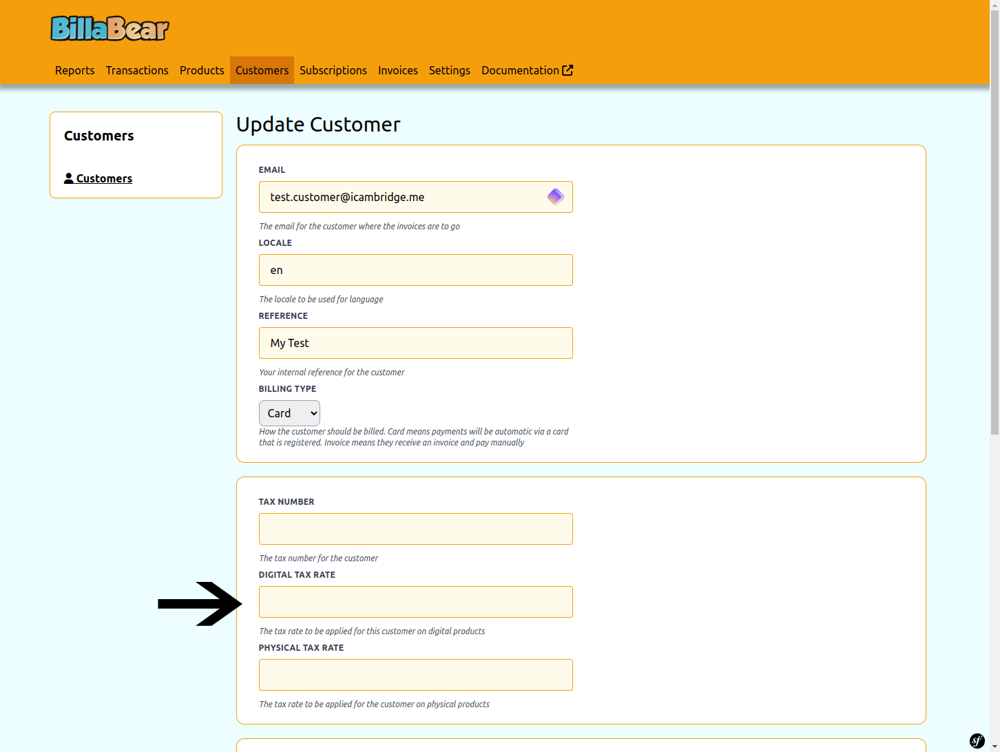
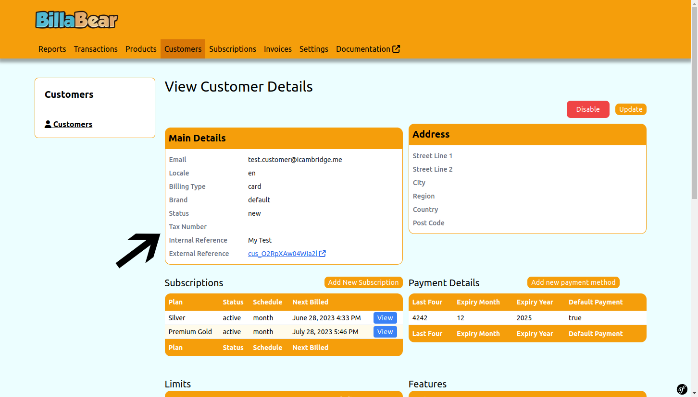
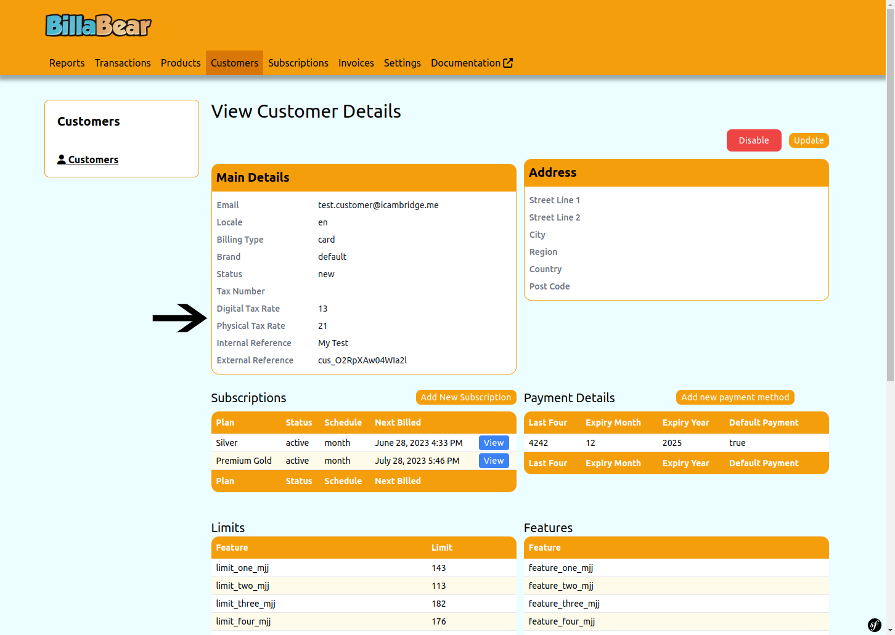

Sometimes it's required to set customer specific tax rates.

## Permissions

To be able to toogle a customer's status the BillaBear admin system you will need to have a ROLE of customer support or higher.

[Check the user roles here.](../user_roles/)

## How It Works

You can set customer specific tax rates for physical and digital goods.

Digital Tax Rate is for digital services.

Standard tax rate is for everything but digital services. Only a few countries have specific tax for digital services.

These rates with override all other tax rates.

## How To

### Set Rates

### No Rates Set

### Tax Rates Set

