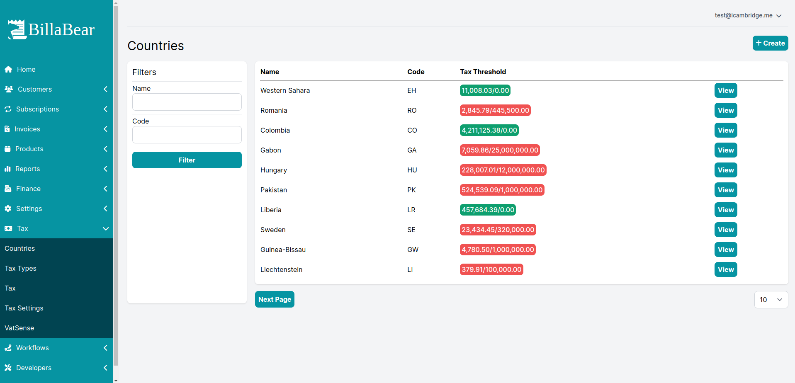
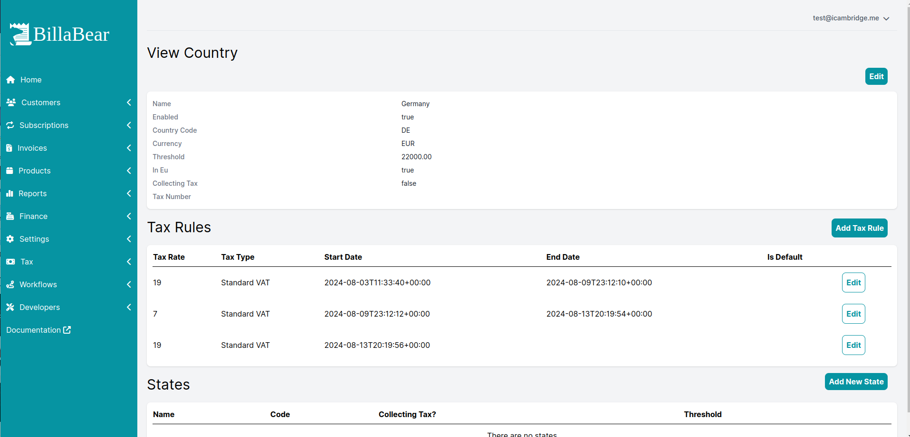
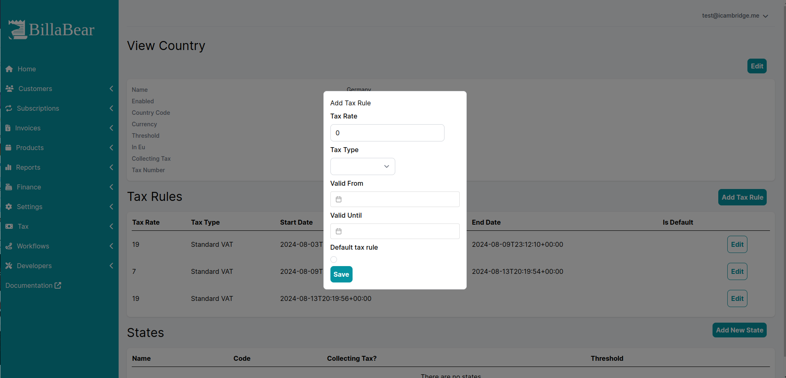
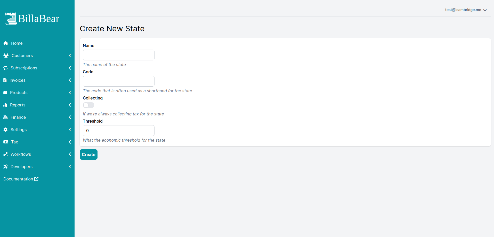
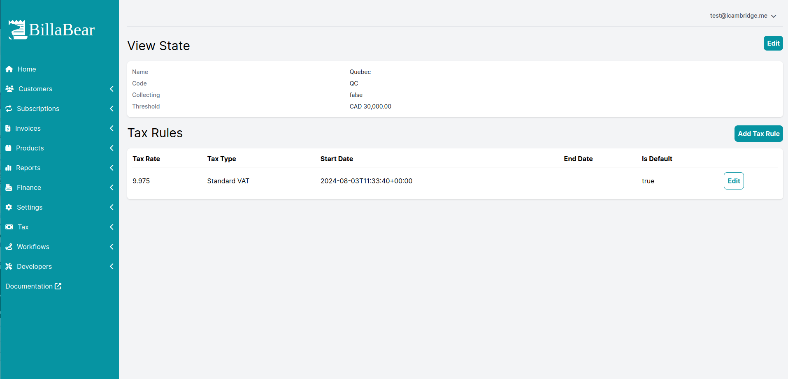

BillaBear allows you to manage the taxes that need to be paid for each country. You're able to have multiple tax rules per country and define a default tax rule if there is no tax rule found for a tax type.

## Country list

Available filters

* Name
* Code

## View Country

On the country view page you'll see lots of information. At the top part you see information such as tax threshold and if we're collecting tax.

Below that you'll see that tax rules, active and past.

Then below that you'll see states that exist.

## Edit/Create Tax Rule

You can manage the tax rules via modals

## Create New States

## View State

The state view looks very similar to the country view but without the states.

