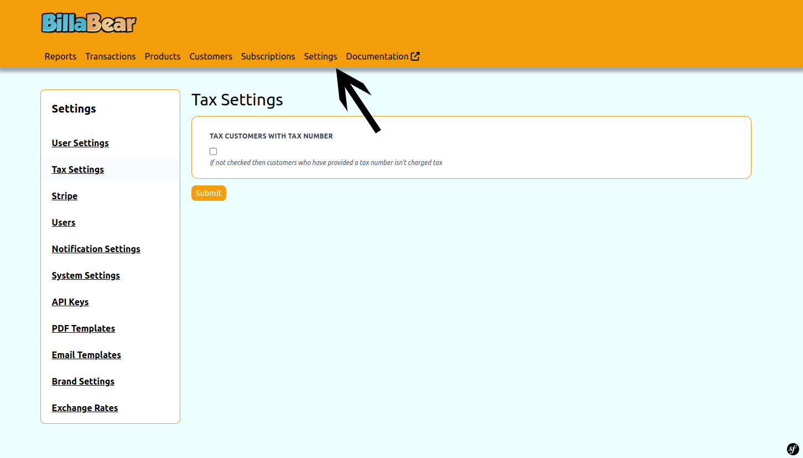
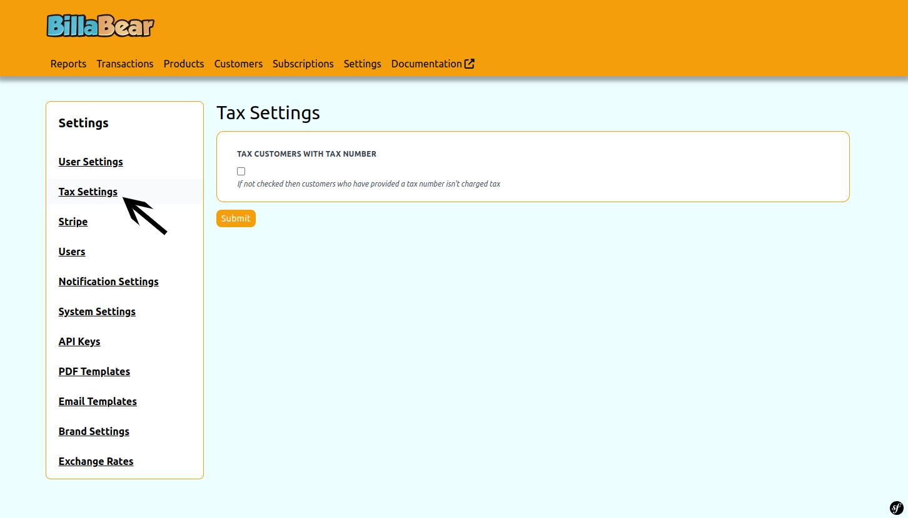
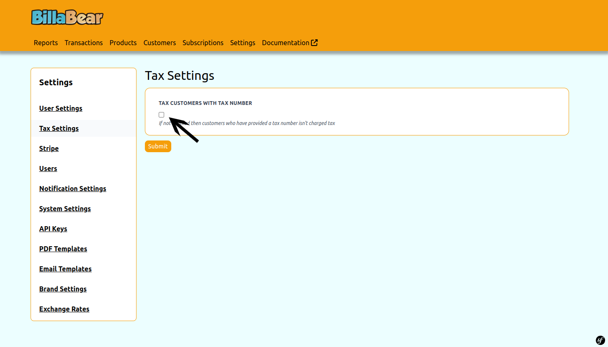
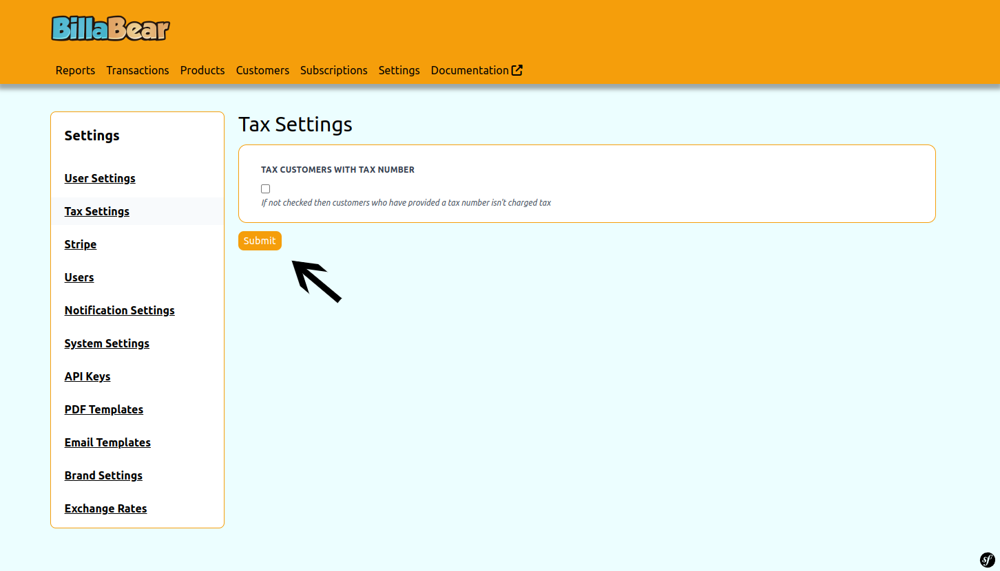

Changing the tax settings is something

## Permissions

To be able to change the plan for a subscription via the BillaBear admin system you will need to have a ROLE of ADMIN.

[Check the user roles here.](../user_roles/)

## How it works

You're able to change tax settings

## How To

### Step 1. Go to Settings

### Step 2. Go to tax settings

### Step 3. Choose tax

### Step 4. Click Save

