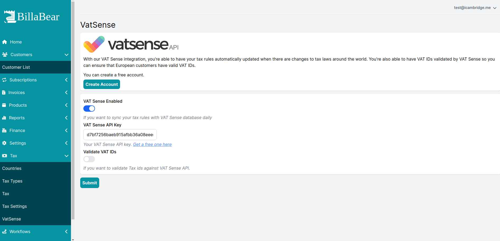
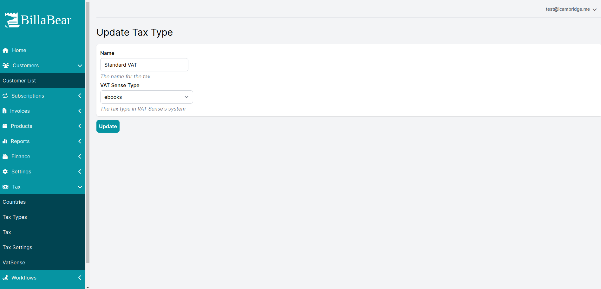

BillaBear integrates with VAT Sense to automate updating your Tax Rules and validating Tax IDs within Europe.

To use this, you must have a VAT Sense account. You can sign up for a free account [here](https://vatsense.com/signup?referral=BILLABEAR)

## Setting it Up

If you want to enable it then you'll need to toggle it here. And then enter the API Key you get from [vatsense.com](https://vatsense.com/signup?referral=BILLABEAR).

Then you can choose if you want to validate Tax IDs or not.

## Configuring Tax Sync'ing

To configure the tax to be synced daily you need to update the tax type to define which VAT Sense tax type it has that applies to it.

