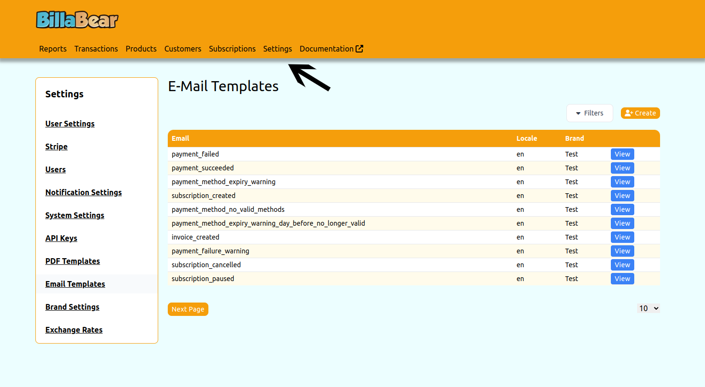
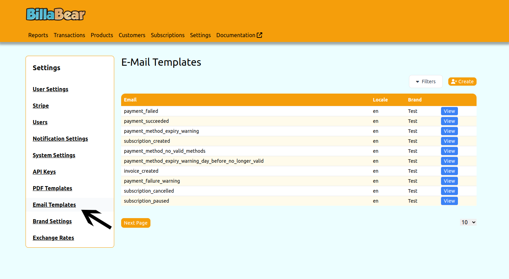
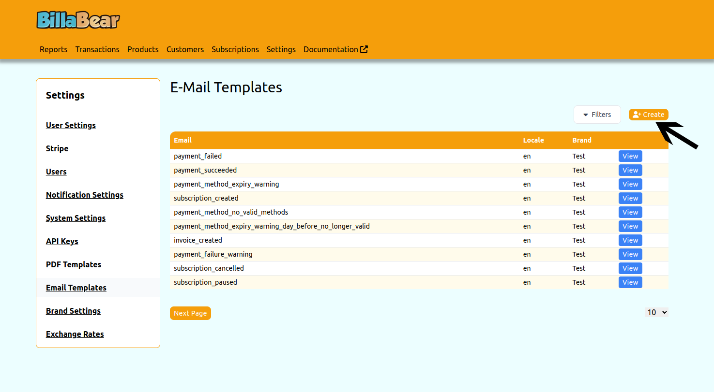
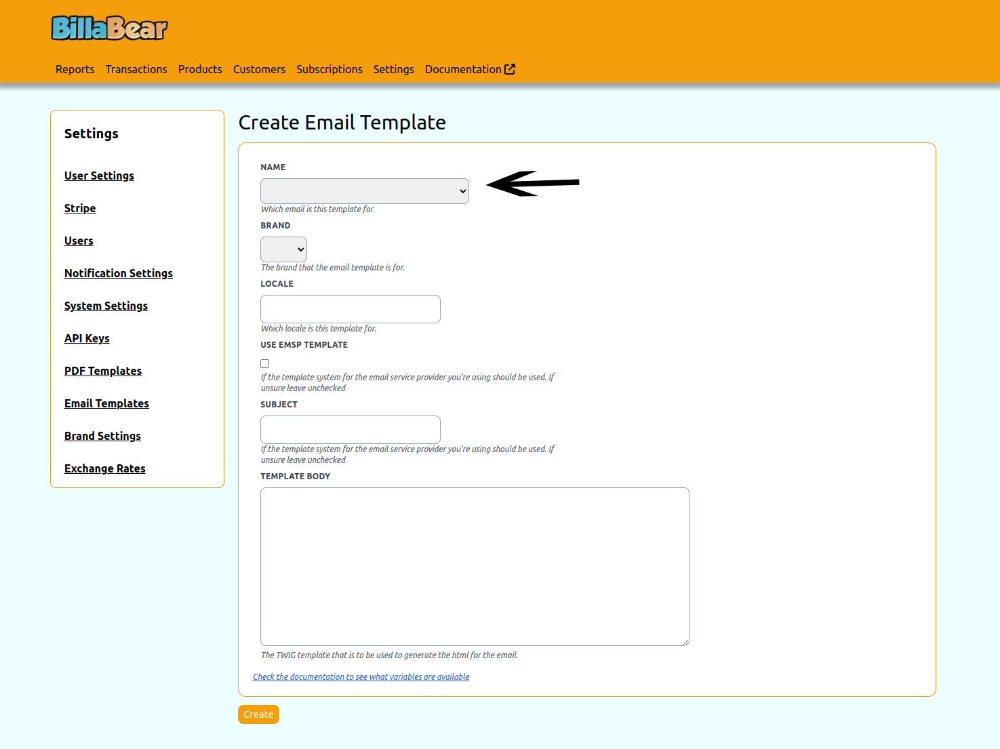
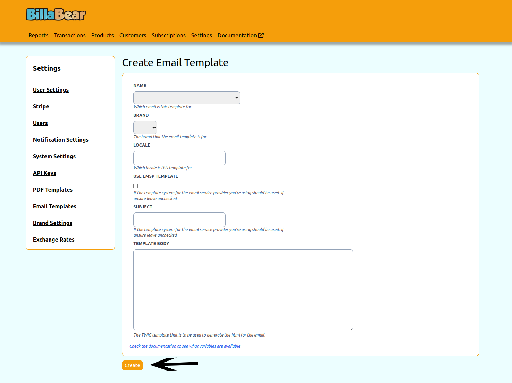

The ability to define which notifications are sent to customers is an important feature.

## Permissions

To be able to toogle a customer's status the BillaBear admin system you will need to have a ROLE of account manager or higher.

[Check the user roles here.](../user_roles/)

## How It Works

There should be an email template for all templates in the default locale. Each locale can only have one version of the template per brand.

If you're using the EMSP templates then the template body doesn't need to be provided.

## How To

### Step 1. Click Settings

### Step 2. Click Email Templates

### Step 3. Click Create

### Step 4. Enter Data

### Step 5. Click Update

