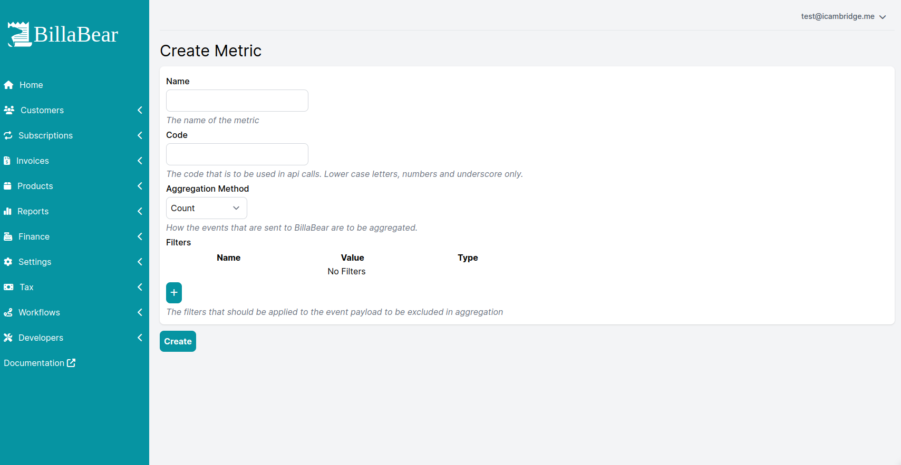

Metrics are at the core of usage. These are used to record the usage.  

## Permissions

The role `ROLE_ACCOUNT_MANAGER` is required to create/edit Metrics.

## Create/Edit

To create/edit a metric you need to define

* Name
* Code
* Aggregation Method
* Ingestion
* Filters

| Field | Description |
| ---   | ---         |
| Name  | The name of the metric |
| Code  | The code for the metric that is to be used for API Requests |
| Aggregation Method | How the metric events should be aggregated into a value |
| Ingestion          | How the data should be ingested |

